assignment01
================
sl
2022-10-04

``` r
library(webshot)
library(lubridate)
```

    ## 
    ## Attaching package: 'lubridate'

    ## The following objects are masked from 'package:base':
    ## 
    ##     date, intersect, setdiff, union

``` r
library(tidyverse)
```

    ## ── Attaching packages
    ## ───────────────────────────────────────
    ## tidyverse 1.3.2 ──

    ## ✔ ggplot2 3.3.6     ✔ purrr   0.3.4
    ## ✔ tibble  3.1.8     ✔ dplyr   1.0.9
    ## ✔ tidyr   1.2.0     ✔ stringr 1.4.1
    ## ✔ readr   2.1.2     ✔ forcats 0.5.2
    ## ── Conflicts ────────────────────────────────────────── tidyverse_conflicts() ──
    ## ✖ lubridate::as.difftime() masks base::as.difftime()
    ## ✖ lubridate::date()        masks base::date()
    ## ✖ dplyr::filter()          masks stats::filter()
    ## ✖ lubridate::intersect()   masks base::intersect()
    ## ✖ dplyr::lag()             masks stats::lag()
    ## ✖ lubridate::setdiff()     masks base::setdiff()
    ## ✖ lubridate::union()       masks base::union()

``` r
library(data.table)
```

    ## 
    ## Attaching package: 'data.table'
    ## 
    ## The following objects are masked from 'package:dplyr':
    ## 
    ##     between, first, last
    ## 
    ## The following object is masked from 'package:purrr':
    ## 
    ##     transpose
    ## 
    ## The following objects are masked from 'package:lubridate':
    ## 
    ##     hour, isoweek, mday, minute, month, quarter, second, wday, week,
    ##     yday, year

``` r
library(leaflet)
```

## Step 1. Conduct EDA Checklist items 2-4

### Read in the data - 2004 and 2019

``` r
setwd("/Users/samuellu/Desktop/PM566/GitHub/pm566-fall2022-labs_Sam/Assignment/assignment01/")
data_2004 <- data.table::fread("ad_viz_plotval_data_2004.csv")
data_2019 <- data.table::fread("ad_viz_plotval_data_2019.csv")
```

### Check the dimensions and headers and footers of the data

``` r
dim(data_2004)
```

    ## [1] 19233    20

``` r
head(data_2004)
```

    ##          Date Source  Site ID POC Daily Mean PM2.5 Concentration    UNITS
    ## 1: 01/01/2004    AQS 60010007   1                           11.0 ug/m3 LC
    ## 2: 01/02/2004    AQS 60010007   1                           12.2 ug/m3 LC
    ## 3: 01/03/2004    AQS 60010007   1                           16.5 ug/m3 LC
    ## 4: 01/04/2004    AQS 60010007   1                           19.5 ug/m3 LC
    ## 5: 01/05/2004    AQS 60010007   1                           11.5 ug/m3 LC
    ## 6: 01/06/2004    AQS 60010007   1                           32.5 ug/m3 LC
    ##    DAILY_AQI_VALUE Site Name DAILY_OBS_COUNT PERCENT_COMPLETE
    ## 1:              46 Livermore               1              100
    ## 2:              51 Livermore               1              100
    ## 3:              60 Livermore               1              100
    ## 4:              67 Livermore               1              100
    ## 5:              48 Livermore               1              100
    ## 6:              94 Livermore               1              100
    ##    AQS_PARAMETER_CODE                     AQS_PARAMETER_DESC CBSA_CODE
    ## 1:              88502 Acceptable PM2.5 AQI & Speciation Mass     41860
    ## 2:              88502 Acceptable PM2.5 AQI & Speciation Mass     41860
    ## 3:              88502 Acceptable PM2.5 AQI & Speciation Mass     41860
    ## 4:              88502 Acceptable PM2.5 AQI & Speciation Mass     41860
    ## 5:              88502 Acceptable PM2.5 AQI & Speciation Mass     41860
    ## 6:              88502 Acceptable PM2.5 AQI & Speciation Mass     41860
    ##                            CBSA_NAME STATE_CODE      STATE COUNTY_CODE  COUNTY
    ## 1: San Francisco-Oakland-Hayward, CA          6 California           1 Alameda
    ## 2: San Francisco-Oakland-Hayward, CA          6 California           1 Alameda
    ## 3: San Francisco-Oakland-Hayward, CA          6 California           1 Alameda
    ## 4: San Francisco-Oakland-Hayward, CA          6 California           1 Alameda
    ## 5: San Francisco-Oakland-Hayward, CA          6 California           1 Alameda
    ## 6: San Francisco-Oakland-Hayward, CA          6 California           1 Alameda
    ##    SITE_LATITUDE SITE_LONGITUDE
    ## 1:      37.68753      -121.7842
    ## 2:      37.68753      -121.7842
    ## 3:      37.68753      -121.7842
    ## 4:      37.68753      -121.7842
    ## 5:      37.68753      -121.7842
    ## 6:      37.68753      -121.7842

``` r
tail(data_2004)
```

    ##          Date Source  Site ID POC Daily Mean PM2.5 Concentration    UNITS
    ## 1: 12/14/2004    AQS 61131003   1                             11 ug/m3 LC
    ## 2: 12/17/2004    AQS 61131003   1                             16 ug/m3 LC
    ## 3: 12/20/2004    AQS 61131003   1                             17 ug/m3 LC
    ## 4: 12/23/2004    AQS 61131003   1                              9 ug/m3 LC
    ## 5: 12/26/2004    AQS 61131003   1                             24 ug/m3 LC
    ## 6: 12/29/2004    AQS 61131003   1                              9 ug/m3 LC
    ##    DAILY_AQI_VALUE            Site Name DAILY_OBS_COUNT PERCENT_COMPLETE
    ## 1:              46 Woodland-Gibson Road               1              100
    ## 2:              59 Woodland-Gibson Road               1              100
    ## 3:              61 Woodland-Gibson Road               1              100
    ## 4:              38 Woodland-Gibson Road               1              100
    ## 5:              76 Woodland-Gibson Road               1              100
    ## 6:              38 Woodland-Gibson Road               1              100
    ##    AQS_PARAMETER_CODE       AQS_PARAMETER_DESC CBSA_CODE
    ## 1:              88101 PM2.5 - Local Conditions     40900
    ## 2:              88101 PM2.5 - Local Conditions     40900
    ## 3:              88101 PM2.5 - Local Conditions     40900
    ## 4:              88101 PM2.5 - Local Conditions     40900
    ## 5:              88101 PM2.5 - Local Conditions     40900
    ## 6:              88101 PM2.5 - Local Conditions     40900
    ##                                  CBSA_NAME STATE_CODE      STATE COUNTY_CODE
    ## 1: Sacramento--Roseville--Arden-Arcade, CA          6 California         113
    ## 2: Sacramento--Roseville--Arden-Arcade, CA          6 California         113
    ## 3: Sacramento--Roseville--Arden-Arcade, CA          6 California         113
    ## 4: Sacramento--Roseville--Arden-Arcade, CA          6 California         113
    ## 5: Sacramento--Roseville--Arden-Arcade, CA          6 California         113
    ## 6: Sacramento--Roseville--Arden-Arcade, CA          6 California         113
    ##    COUNTY SITE_LATITUDE SITE_LONGITUDE
    ## 1:   Yolo      38.66121      -121.7327
    ## 2:   Yolo      38.66121      -121.7327
    ## 3:   Yolo      38.66121      -121.7327
    ## 4:   Yolo      38.66121      -121.7327
    ## 5:   Yolo      38.66121      -121.7327
    ## 6:   Yolo      38.66121      -121.7327

``` r
dim(data_2019)
```

    ## [1] 53156    20

``` r
head(data_2019)
```

    ##          Date Source  Site ID POC Daily Mean PM2.5 Concentration    UNITS
    ## 1: 01/01/2019    AQS 60010007   3                            5.7 ug/m3 LC
    ## 2: 01/02/2019    AQS 60010007   3                           11.9 ug/m3 LC
    ## 3: 01/03/2019    AQS 60010007   3                           20.1 ug/m3 LC
    ## 4: 01/04/2019    AQS 60010007   3                           28.8 ug/m3 LC
    ## 5: 01/05/2019    AQS 60010007   3                           11.2 ug/m3 LC
    ## 6: 01/06/2019    AQS 60010007   3                            2.7 ug/m3 LC
    ##    DAILY_AQI_VALUE Site Name DAILY_OBS_COUNT PERCENT_COMPLETE
    ## 1:              24 Livermore               1              100
    ## 2:              50 Livermore               1              100
    ## 3:              68 Livermore               1              100
    ## 4:              86 Livermore               1              100
    ## 5:              47 Livermore               1              100
    ## 6:              11 Livermore               1              100
    ##    AQS_PARAMETER_CODE       AQS_PARAMETER_DESC CBSA_CODE
    ## 1:              88101 PM2.5 - Local Conditions     41860
    ## 2:              88101 PM2.5 - Local Conditions     41860
    ## 3:              88101 PM2.5 - Local Conditions     41860
    ## 4:              88101 PM2.5 - Local Conditions     41860
    ## 5:              88101 PM2.5 - Local Conditions     41860
    ## 6:              88101 PM2.5 - Local Conditions     41860
    ##                            CBSA_NAME STATE_CODE      STATE COUNTY_CODE  COUNTY
    ## 1: San Francisco-Oakland-Hayward, CA          6 California           1 Alameda
    ## 2: San Francisco-Oakland-Hayward, CA          6 California           1 Alameda
    ## 3: San Francisco-Oakland-Hayward, CA          6 California           1 Alameda
    ## 4: San Francisco-Oakland-Hayward, CA          6 California           1 Alameda
    ## 5: San Francisco-Oakland-Hayward, CA          6 California           1 Alameda
    ## 6: San Francisco-Oakland-Hayward, CA          6 California           1 Alameda
    ##    SITE_LATITUDE SITE_LONGITUDE
    ## 1:      37.68753      -121.7842
    ## 2:      37.68753      -121.7842
    ## 3:      37.68753      -121.7842
    ## 4:      37.68753      -121.7842
    ## 5:      37.68753      -121.7842
    ## 6:      37.68753      -121.7842

``` r
tail(data_2019)
```

    ##          Date Source  Site ID POC Daily Mean PM2.5 Concentration    UNITS
    ## 1: 11/11/2019    AQS 61131003   1                           13.5 ug/m3 LC
    ## 2: 11/17/2019    AQS 61131003   1                           18.1 ug/m3 LC
    ## 3: 11/29/2019    AQS 61131003   1                           12.5 ug/m3 LC
    ## 4: 12/17/2019    AQS 61131003   1                           23.8 ug/m3 LC
    ## 5: 12/23/2019    AQS 61131003   1                            1.0 ug/m3 LC
    ## 6: 12/29/2019    AQS 61131003   1                            9.1 ug/m3 LC
    ##    DAILY_AQI_VALUE            Site Name DAILY_OBS_COUNT PERCENT_COMPLETE
    ## 1:              54 Woodland-Gibson Road               1              100
    ## 2:              64 Woodland-Gibson Road               1              100
    ## 3:              52 Woodland-Gibson Road               1              100
    ## 4:              76 Woodland-Gibson Road               1              100
    ## 5:               4 Woodland-Gibson Road               1              100
    ## 6:              38 Woodland-Gibson Road               1              100
    ##    AQS_PARAMETER_CODE       AQS_PARAMETER_DESC CBSA_CODE
    ## 1:              88101 PM2.5 - Local Conditions     40900
    ## 2:              88101 PM2.5 - Local Conditions     40900
    ## 3:              88101 PM2.5 - Local Conditions     40900
    ## 4:              88101 PM2.5 - Local Conditions     40900
    ## 5:              88101 PM2.5 - Local Conditions     40900
    ## 6:              88101 PM2.5 - Local Conditions     40900
    ##                                  CBSA_NAME STATE_CODE      STATE COUNTY_CODE
    ## 1: Sacramento--Roseville--Arden-Arcade, CA          6 California         113
    ## 2: Sacramento--Roseville--Arden-Arcade, CA          6 California         113
    ## 3: Sacramento--Roseville--Arden-Arcade, CA          6 California         113
    ## 4: Sacramento--Roseville--Arden-Arcade, CA          6 California         113
    ## 5: Sacramento--Roseville--Arden-Arcade, CA          6 California         113
    ## 6: Sacramento--Roseville--Arden-Arcade, CA          6 California         113
    ##    COUNTY SITE_LATITUDE SITE_LONGITUDE
    ## 1:   Yolo      38.66121      -121.7327
    ## 2:   Yolo      38.66121      -121.7327
    ## 3:   Yolo      38.66121      -121.7327
    ## 4:   Yolo      38.66121      -121.7327
    ## 5:   Yolo      38.66121      -121.7327
    ## 6:   Yolo      38.66121      -121.7327

### Check the variable types in the data

``` r
str(data_2004)
```

    ## Classes 'data.table' and 'data.frame':   19233 obs. of  20 variables:
    ##  $ Date                          : chr  "01/01/2004" "01/02/2004" "01/03/2004" "01/04/2004" ...
    ##  $ Source                        : chr  "AQS" "AQS" "AQS" "AQS" ...
    ##  $ Site ID                       : int  60010007 60010007 60010007 60010007 60010007 60010007 60010007 60010007 60010007 60010007 ...
    ##  $ POC                           : int  1 1 1 1 1 1 1 1 1 1 ...
    ##  $ Daily Mean PM2.5 Concentration: num  11 12.2 16.5 19.5 11.5 32.5 15.5 29.9 21 15.7 ...
    ##  $ UNITS                         : chr  "ug/m3 LC" "ug/m3 LC" "ug/m3 LC" "ug/m3 LC" ...
    ##  $ DAILY_AQI_VALUE               : int  46 51 60 67 48 94 58 88 70 59 ...
    ##  $ Site Name                     : chr  "Livermore" "Livermore" "Livermore" "Livermore" ...
    ##  $ DAILY_OBS_COUNT               : int  1 1 1 1 1 1 1 1 1 1 ...
    ##  $ PERCENT_COMPLETE              : int  100 100 100 100 100 100 100 100 100 100 ...
    ##  $ AQS_PARAMETER_CODE            : int  88502 88502 88502 88502 88502 88502 88502 88502 88502 88101 ...
    ##  $ AQS_PARAMETER_DESC            : chr  "Acceptable PM2.5 AQI & Speciation Mass" "Acceptable PM2.5 AQI & Speciation Mass" "Acceptable PM2.5 AQI & Speciation Mass" "Acceptable PM2.5 AQI & Speciation Mass" ...
    ##  $ CBSA_CODE                     : int  41860 41860 41860 41860 41860 41860 41860 41860 41860 41860 ...
    ##  $ CBSA_NAME                     : chr  "San Francisco-Oakland-Hayward, CA" "San Francisco-Oakland-Hayward, CA" "San Francisco-Oakland-Hayward, CA" "San Francisco-Oakland-Hayward, CA" ...
    ##  $ STATE_CODE                    : int  6 6 6 6 6 6 6 6 6 6 ...
    ##  $ STATE                         : chr  "California" "California" "California" "California" ...
    ##  $ COUNTY_CODE                   : int  1 1 1 1 1 1 1 1 1 1 ...
    ##  $ COUNTY                        : chr  "Alameda" "Alameda" "Alameda" "Alameda" ...
    ##  $ SITE_LATITUDE                 : num  37.7 37.7 37.7 37.7 37.7 ...
    ##  $ SITE_LONGITUDE                : num  -122 -122 -122 -122 -122 ...
    ##  - attr(*, ".internal.selfref")=<externalptr>

``` r
str(data_2019)
```

    ## Classes 'data.table' and 'data.frame':   53156 obs. of  20 variables:
    ##  $ Date                          : chr  "01/01/2019" "01/02/2019" "01/03/2019" "01/04/2019" ...
    ##  $ Source                        : chr  "AQS" "AQS" "AQS" "AQS" ...
    ##  $ Site ID                       : int  60010007 60010007 60010007 60010007 60010007 60010007 60010007 60010007 60010007 60010007 ...
    ##  $ POC                           : int  3 3 3 3 3 3 3 3 3 3 ...
    ##  $ Daily Mean PM2.5 Concentration: num  5.7 11.9 20.1 28.8 11.2 2.7 2.8 7 3.1 7.1 ...
    ##  $ UNITS                         : chr  "ug/m3 LC" "ug/m3 LC" "ug/m3 LC" "ug/m3 LC" ...
    ##  $ DAILY_AQI_VALUE               : int  24 50 68 86 47 11 12 29 13 30 ...
    ##  $ Site Name                     : chr  "Livermore" "Livermore" "Livermore" "Livermore" ...
    ##  $ DAILY_OBS_COUNT               : int  1 1 1 1 1 1 1 1 1 1 ...
    ##  $ PERCENT_COMPLETE              : num  100 100 100 100 100 100 100 100 100 100 ...
    ##  $ AQS_PARAMETER_CODE            : int  88101 88101 88101 88101 88101 88101 88101 88101 88101 88101 ...
    ##  $ AQS_PARAMETER_DESC            : chr  "PM2.5 - Local Conditions" "PM2.5 - Local Conditions" "PM2.5 - Local Conditions" "PM2.5 - Local Conditions" ...
    ##  $ CBSA_CODE                     : int  41860 41860 41860 41860 41860 41860 41860 41860 41860 41860 ...
    ##  $ CBSA_NAME                     : chr  "San Francisco-Oakland-Hayward, CA" "San Francisco-Oakland-Hayward, CA" "San Francisco-Oakland-Hayward, CA" "San Francisco-Oakland-Hayward, CA" ...
    ##  $ STATE_CODE                    : int  6 6 6 6 6 6 6 6 6 6 ...
    ##  $ STATE                         : chr  "California" "California" "California" "California" ...
    ##  $ COUNTY_CODE                   : int  1 1 1 1 1 1 1 1 1 1 ...
    ##  $ COUNTY                        : chr  "Alameda" "Alameda" "Alameda" "Alameda" ...
    ##  $ SITE_LATITUDE                 : num  37.7 37.7 37.7 37.7 37.7 ...
    ##  $ SITE_LONGITUDE                : num  -122 -122 -122 -122 -122 ...
    ##  - attr(*, ".internal.selfref")=<externalptr>

### Check for any data issues, particularly in the key variable we are analyzing

``` r
#table(data_2004$Date)
#table(data_2004$`Site Name`)
#table(data_2004$CBSA_NAME)
#table(data_2004$STATE)
table(data_2004$COUNTY)
```

    ## 
    ##         Alameda           Butte       Calaveras          Colusa    Contra Costa 
    ##             458             444              61             201             259 
    ##       Del Norte       El Dorado          Fresno        Humboldt        Imperial 
    ##             117             128             811              58             366 
    ##            Inyo            Kern           Kings            Lake     Los Angeles 
    ##             247            1304              84              60            2243 
    ##           Marin        Mariposa       Mendocino          Merced            Mono 
    ##             120             320              61              90             181 
    ##        Monterey          Nevada          Orange          Placer          Plumas 
    ##              60             232             529             246             258 
    ##       Riverside      Sacramento      San Benito  San Bernardino       San Diego 
    ##            1203            1453             122             893            1431 
    ##   San Francisco     San Joaquin San Luis Obispo       San Mateo   Santa Barbara 
    ##             560             122             176             354             225 
    ##     Santa Clara      Santa Cruz          Shasta        Siskiyou          Solano 
    ##             660              56             181             117             361 
    ##          Sonoma      Stanislaus          Sutter         Trinity          Tulare 
    ##              92             183             309             115             627 
    ##         Ventura            Yolo 
    ##             580             475

``` r
#table(data_2019$Date)
#table(data_2019$`Site Name`)
#table(data_2019$CBSA_NAME)
#table(data_2019$STATE)
table(data_2019$COUNTY)
```

    ## 
    ##         Alameda           Butte       Calaveras          Colusa    Contra Costa 
    ##            2137            1254             338             728             811 
    ##       Del Norte       El Dorado          Fresno           Glenn        Humboldt 
    ##             309             177            2671             356             107 
    ##        Imperial            Inyo            Kern           Kings            Lake 
    ##            1006             902            2084             805              60 
    ##     Los Angeles          Madera           Marin        Mariposa       Mendocino 
    ##            4918             357             457             536             713 
    ##          Merced            Mono        Monterey            Napa          Nevada 
    ##             479             890            1126             355             526 
    ##          Orange          Placer          Plumas       Riverside      Sacramento 
    ##             883            1685             530            4368            2134 
    ##      San Benito  San Bernardino       San Diego   San Francisco     San Joaquin 
    ##             466            2617            2155             359            1307 
    ## San Luis Obispo       San Mateo   Santa Barbara     Santa Clara      Santa Cruz 
    ##            1419             344            1518            1200             697 
    ##          Shasta        Siskiyou          Solano          Sonoma      Stanislaus 
    ##             146             458             716             343             798 
    ##          Sutter          Tehama         Trinity          Tulare         Ventura 
    ##             708             353             345             975            2125 
    ##            Yolo 
    ##             405

``` r
#summary(data_2004$`Daily Mean PM2.5 Concentration`)
summary(data_2004$CBSA_CODE) #1253 NA's
```

    ##    Min. 1st Qu.  Median    Mean 3rd Qu.    Max.    NA's 
    ##   12540   31080   40140   35328   41860   49700    1253

``` r
#summary(data_2004$COUNTY_CODE)
#summary(data_2004$SITE_LATITUDE)
#summary(data_2004$SITE_LONGITUDE)
```

``` r
#summary(data_2019$`Daily Mean PM2.5 Concentration`)
summary(data_2019$CBSA_CODE) #4181 NA's
```

    ##    Min. 1st Qu.  Median    Mean 3rd Qu.    Max.    NA's 
    ##   12540   31080   40140   35839   41860   49700    4181

``` r
#summary(data_2019$COUNTY_CODE)
#summary(data_2019$SITE_LATITUDE)
#summary(data_2019$SITE_LONGITUDE)
```

There are 1253 NAs in CBSA_CODE of data_2004 and 4181 NAs in CBSA_CODE
of data_2019 but it is fine.

## Step 2. Combine the two years of data into one data frame. Use the Date variable to create a new column for year, which will serve as an identifier.

``` r
data_2004_2019 <- rbind(data_2004, data_2019) 
pm <- mutate(data_2004_2019, year = factor(rep(c(2004, 2019), c(nrow(data_2004), nrow(data_2019))))) %>%
        rename(PM2.5 = `Daily Mean PM2.5 Concentration`)
```

Create a factor variable indicating which year the data comes from. I
also rename the Daily Mean PM2.5 Concentration variable to a more
sensible PM2.5

``` r
with(pm, tapply(PM2.5, year, summary))
```

    ## $`2004`
    ##    Min. 1st Qu.  Median    Mean 3rd Qu.    Max. 
    ##   -0.10    6.00   10.10   13.13   16.30  251.00 
    ## 
    ## $`2019`
    ##    Min. 1st Qu.  Median    Mean 3rd Qu.    Max. 
    ##   -2.20    4.00    6.50    7.74    9.90  120.90

From the summary of 2004 and 2019 appear there are some negative values
of PM2.5.

### Change the names of the key variables so that they are easier to refer to in your code.

``` r
colnames(pm)[19] <- "lat"
colnames(pm)[20] <- "lon"
```

``` r
colnames(data_2004_2019)[5] <- "PM2.5"
colnames(data_2004_2019)[19] <- "lat"
colnames(data_2004_2019)[20] <- "lon"
```

``` r
colnames(data_2004)[5] <- "PM2.5"
colnames(data_2004)[19] <- "lat"
colnames(data_2004)[20] <- "lon"

colnames(data_2019)[5] <- "PM2.5"
colnames(data_2019)[19] <- "lat"
colnames(data_2019)[20] <- "lon"
```

## Step 3. Create a basic map in leaflet() that shows the locations of the sites (make sure to use different colors for each year).

``` r
leaflet() %>%
  addProviderTiles('OpenStreetMap') %>% 
  addCircles(data = unique(pm[year == "2004"]),
             lat=~lat,lng=~lon, 
             color = "blue",
             opacity = 0.1, fillOpacity = 1, radius = 500) %>% 
  addCircles(data = unique(pm[year == "2019"]),
             lat=~lat,lng=~lon, 
             color = "red",
             opacity = 0.1, fillOpacity = 1, radius = 100)
```

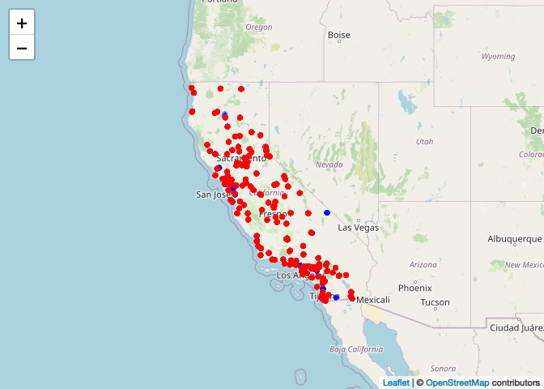<!-- --> \###
Summarize the spatial distribution of the monitoring sites.

It seems that there are more monitoring sites in the bit cities like San
Jose, LA, San Francisco and San Diego.

## Step 4. Check for any missing or implausible values of PM2.5 in the combined dataset

``` r
summary(pm$PM2.5)
```

    ##    Min. 1st Qu.  Median    Mean 3rd Qu.    Max. 
    ##  -2.200   4.400   7.200   9.172  11.300 251.000

``` r
mean(is.na(pm$PM2.5))
```

    ## [1] 0

``` r
nrow(pm[PM2.5 <0])
```

    ## [1] 283

There is no missing values of PM2.5 in the combined dataset. However, it
is implausible to have negative value of PM2.5.

``` r
filter(pm, year == "2004") %>% summarize(negative = mean(PM2.5 < 0, na.rm = TRUE))
```

    ##       negative
    ## 1 5.199397e-05

``` r
filter(pm, year == "2019") %>% summarize(negative = mean(PM2.5 < 0, na.rm = TRUE))
```

    ##     negative
    ## 1 0.00530514

However, there is a relatively small proportion of values that are
negative.

### Explore the proportions of each and provide a summary of any temporal patterns you see in these observations.

``` r
length(unique(pm[year ==2004]$`Site ID`))
```

    ## [1] 106

``` r
length(unique(pm[year ==2019]$`Site ID`))
```

    ## [1] 160

``` r
mean(pm[year==2004]$PM2.5)
```

    ## [1] 13.13038

``` r
mean(pm[year==2019]$PM2.5)
```

    ## [1] 7.7398

Monitoring sites were getting more and more. The total mean pm2.5 level
was lower in 2019 than in 2004.

## Step 5. Explore the main question of interest at three different spatial levels(state, county, site in Los Angeles)

### Create exploratory plots (e.g.boxplots, histograms, line plots)

### summary statistics that best suit each level of data

### Be sure to write up explanations of what you observe in these data.

First, I create 2004 and 2019 datasets with Date, STATE, COUNTY, Site
Name, pm2.5, lat, and lon by Site ID.

``` r
data_2004_avg <- data_2004[, .(
  Date = Date,
  STATE = STATE,
  COUNTY = COUNTY,
  `Site Name` =`Site Name`,
  PM2.5 = mean(PM2.5, na.rm = T),
  lat = mean(lat, na.rm = T), 
  lon = mean(lon, na.rm = T)
), by="Site ID"]

data_2004_avg$year <- "2004"

data_2019_avg <- data_2019[, .(
  Date = Date,
  STATE = STATE,
  COUNTY = COUNTY,
  `Site Name` =`Site Name`,
  PM2.5 = mean(PM2.5, na.rm = T),
  lat = mean(lat, na.rm = T), 
  lon = mean(lon, na.rm = T)
), by="Site ID"]

data_2019_avg$year <- "2019"
```

Second, I merged two datasets.

``` r
pm_avg <- rbind(data_2004_avg, data_2019_avg)
```

Add one column of region.

``` r
pm_avg[, region := fifelse(lon >= -98 & lat > 39.71, "NE",
                fifelse(lon < -98 & lat > 39.71, "NW",
                fifelse(lon < -98 & lat <= 39.71, "SW","SE")))
   ]
table(pm_avg$region)
```

    ## 
    ##    NW    SW 
    ##  4110 68279

Add on column of pm_health (pm2.5 \<= 12 is labeled as health).

``` r
pm_avg[, pm_health := fifelse(PM2.5 <= 12, "healthy",
                         fifelse(PM2.5 > 12 & PM2.5 < 35, "normal", "unhealthy"))]

table(pm_avg$pm_health)
```

    ## 
    ## healthy  normal 
    ##   56740   15649

### Box plots

``` r
#set.seed(2015)
#idx <- sample(nrow(pm), 1000)
qplot(year , log2(PM2.5), data = pm_avg, geom = "boxplot")
```

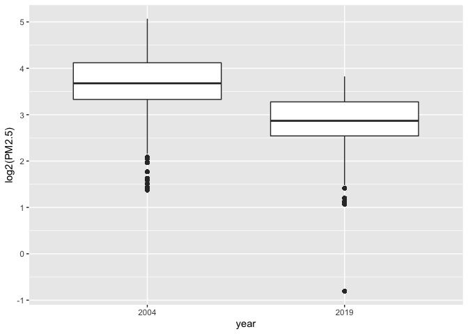<!-- -->

From the raw boxplot, it seems that on average, the levels of PM in 2019
are lower than they were in 2004.

``` r
pm_avg[STATE == "California"] %>% 
  ggplot() + 
  geom_boxplot(mapping = aes(x = year, y = PM2.5, color=pm_health, fill = pm_health)) + 
  facet_wrap(~ region, nrow = 1)
```

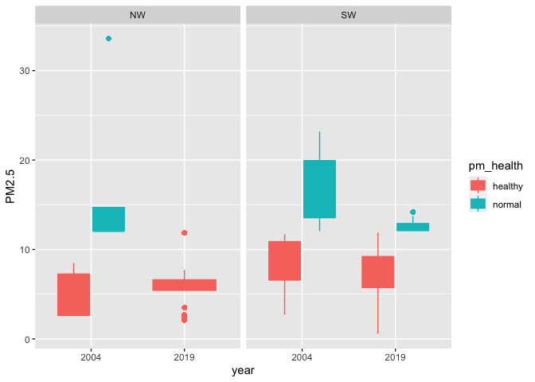<!-- -->

In California, southwestern region pm2.5 level is higher than
northwestern region.

``` r
pm_avg[COUNTY == "Los Angeles"] %>% 
  ggplot() + 
  geom_boxplot(mapping = aes(x = year, y = PM2.5, color=pm_health, fill = pm_health)) + 
  facet_wrap(~ region, nrow = 1)
```

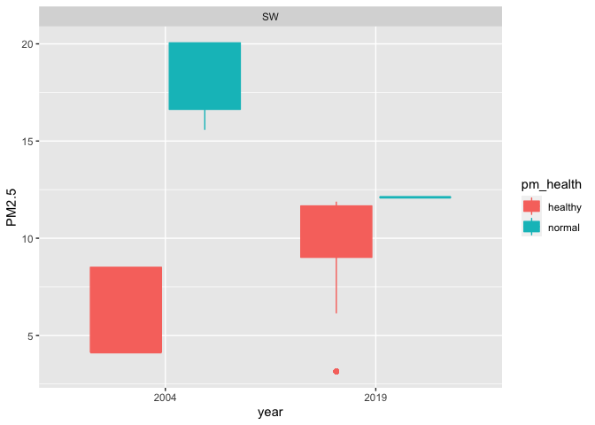<!-- -->

In Los Angeles, pm2.5 level is higher in 2004 than in 2019.

``` r
pm_avg[`Site Name` == "Los Angeles-North Main Street"] %>% 
  ggplot() + 
  geom_boxplot(mapping = aes(x = year, y = PM2.5, color=pm_health, fill = pm_health)) + 
  facet_wrap(~ region, nrow = 1)
```

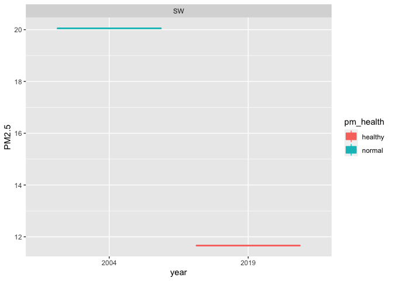<!-- -->

In the Los Angeles-North Main Street, pm2.5 level turns into healthy in
2019.

### Violin plots

``` r
ggplot(data = pm_avg[STATE == "California"], aes(x=year, y=PM2.5, color=pm_health, fill = pm_health)) +
 geom_violin() +
 geom_point() +
 facet_wrap(~ region, nrow = 1)
```

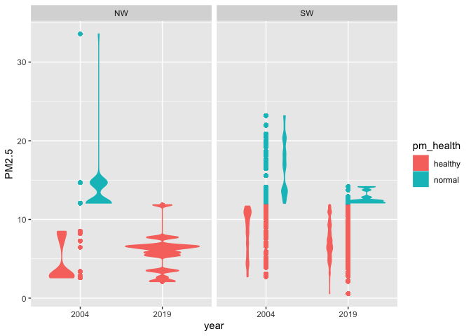<!-- -->

California pm2.5 level is lower in 2019 than in 2004 in both
northwestern and southwestern.

``` r
ggplot(data = pm_avg[COUNTY == "Los Angeles"], aes(x=year, y=PM2.5, color=pm_health, fill = pm_health)) +
 geom_violin() +
 geom_point() +
 facet_wrap(~ region, nrow = 1)
```

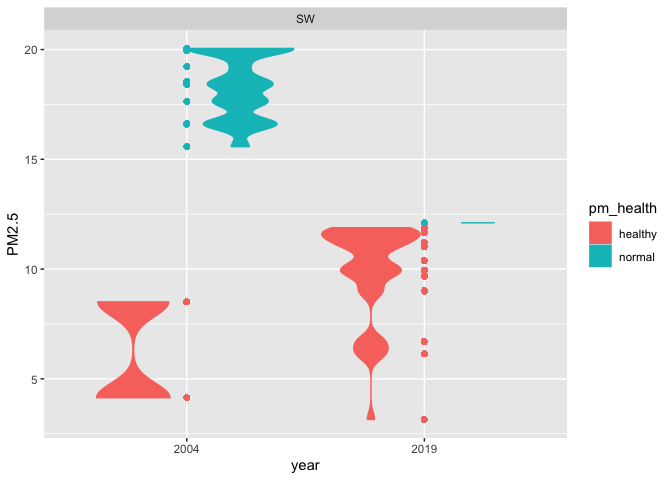<!-- -->

In Los Angeles, most pm2.5 levels is healthier in 2019 than in 2004.

``` r
ggplot(data = pm_avg[`Site Name` == "Los Angeles-North Main Street"], aes(x=year, y=PM2.5, color=pm_health, fill = pm_health)) +
 geom_violin() +
 geom_point()
```

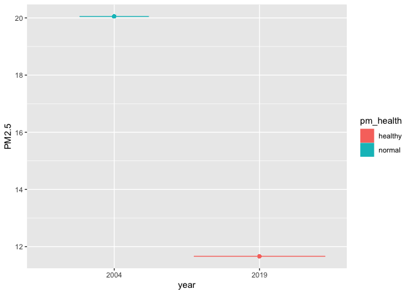<!-- -->

On main street in LA, its pm2.5 level used to be higher in 2004 but it’s
within the healthy range in 2019.

### Histograms

``` r
ggplot(data = pm_avg[STATE == "California"], aes(x=PM2.5, color=year, fill = year)) +
  geom_histogram(fill="white", alpha=0.5, position="identity") +
   facet_wrap(~ region, nrow = 1)
```

    ## `stat_bin()` using `bins = 30`. Pick better value with `binwidth`.

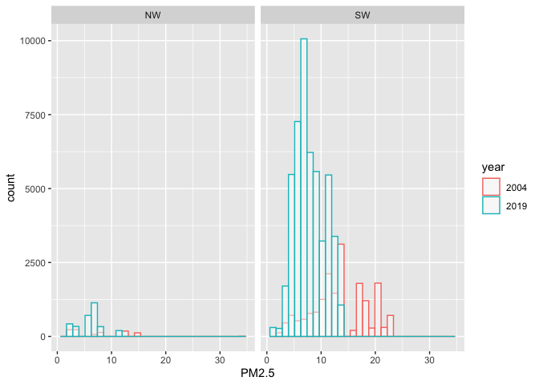<!-- -->

In this histogram, there are more data in southwestern region than in
northwestern region.

``` r
ggplot(data = pm_avg[COUNTY == "Los Angeles"], aes(x=PM2.5, color=year, fill = year)) +
  geom_histogram(fill="white", alpha=0.5, position="identity") +
  facet_wrap(~ region, nrow = 1)
```

    ## `stat_bin()` using `bins = 30`. Pick better value with `binwidth`.

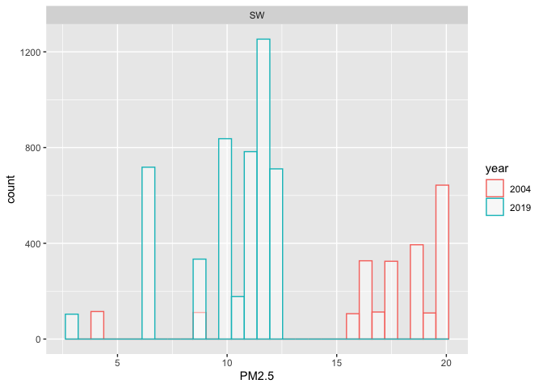<!-- -->

In Los Angeles, there are more counts in the range of 15 to 20 in 2004
than in 2019.

``` r
ggplot(data = pm_avg[`Site Name` == "Los Angeles-North Main Street"], aes(x=PM2.5, color=year, fill = year)) +
  geom_histogram(fill="white", alpha=0.5, position="identity") +
  facet_wrap(~ region, nrow = 1)
```

    ## `stat_bin()` using `bins = 30`. Pick better value with `binwidth`.

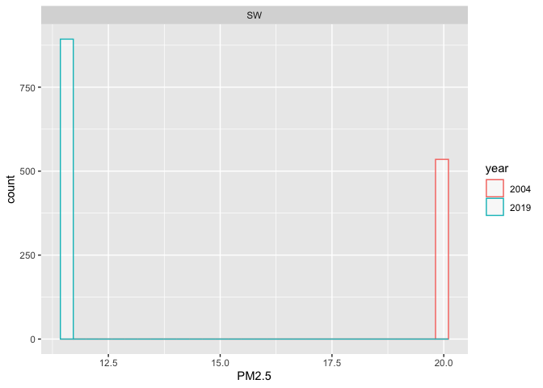<!-- -->

On the North Main Street, its used to get pm2.5 levels around 20 in
2004. However, it is lower in 2019.

### examining changes in PM at the county level. This analysis falls somewhere in between looking at the entire State all at once and looking at an individual monitor.

What we do here is calculate the mean of PM for each county in 2004 and
2019

``` r
county_pm <- group_by(pm, year, COUNTY) %>% summarize(PM2.5 = mean(PM2.5, na.rm = TRUE))
```

    ## `summarise()` has grouped output by 'year'. You can override using the
    ## `.groups` argument.

``` r
head(county_pm)
```

    ## # A tibble: 6 × 3
    ## # Groups:   year [1]
    ##   year  COUNTY       PM2.5
    ##   <fct> <chr>        <dbl>
    ## 1 2004  Alameda      11.0 
    ## 2 2004  Butte        10.1 
    ## 3 2004  Calaveras     7.61
    ## 4 2004  Colusa       10.0 
    ## 5 2004  Contra Costa 12.8 
    ## 6 2004  Del Norte     3.41

``` r
qplot(years, PM2.5, data = mutate(county_pm, years = as.numeric(as.character(year))), 
      color = factor(COUNTY), 
      geom = c("point", "line"))
```

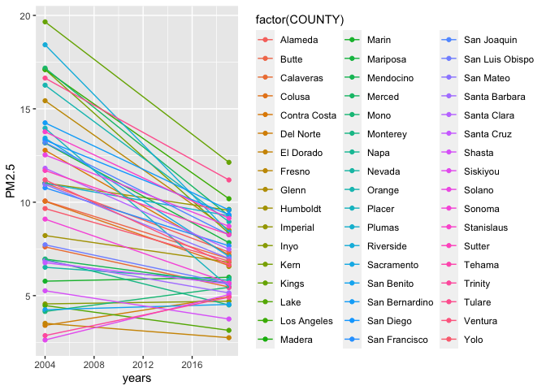<!-- -->

It shows that many counties have decreased the average pm2.5 levels from
2004 to 2019 but a few states actually increased their levels.

## Whether daily concentrations of PM2.5 have decreased in California over the last 15 years (from 2004 to 2019)

From above data and plots, I would say that the daily concentrations of
p2.5 have decreased in California over the last 15 years.
