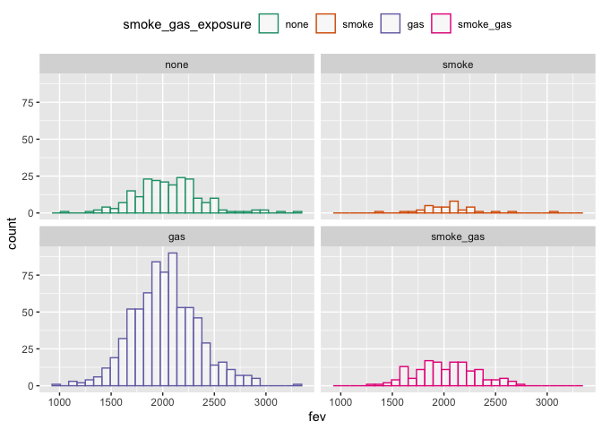
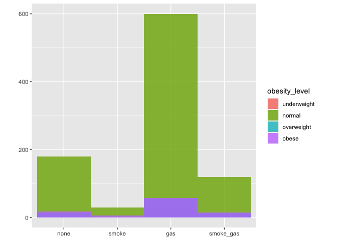
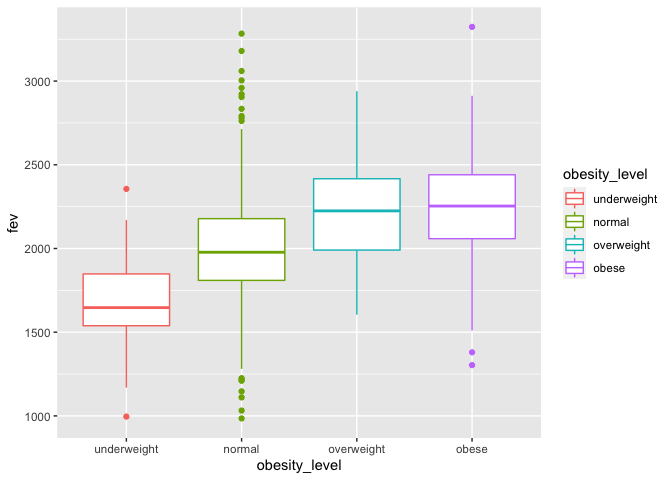
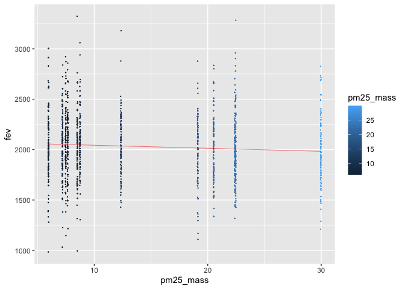

assignment02
================
sl
2022-10-06

``` r
library(lubridate)
```

    ## 
    ## Attaching package: 'lubridate'

    ## The following objects are masked from 'package:base':
    ## 
    ##     date, intersect, setdiff, union

``` r
library(tidyverse)
```

    ## ── Attaching packages
    ## ───────────────────────────────────────
    ## tidyverse 1.3.2 ──

    ## ✔ ggplot2 3.3.6     ✔ purrr   0.3.4
    ## ✔ tibble  3.1.8     ✔ dplyr   1.0.9
    ## ✔ tidyr   1.2.0     ✔ stringr 1.4.1
    ## ✔ readr   2.1.2     ✔ forcats 0.5.2
    ## ── Conflicts ────────────────────────────────────────── tidyverse_conflicts() ──
    ## ✖ lubridate::as.difftime() masks base::as.difftime()
    ## ✖ lubridate::date()        masks base::date()
    ## ✖ dplyr::filter()          masks stats::filter()
    ## ✖ lubridate::intersect()   masks base::intersect()
    ## ✖ dplyr::lag()             masks stats::lag()
    ## ✖ lubridate::setdiff()     masks base::setdiff()
    ## ✖ lubridate::union()       masks base::union()

``` r
library(leaflet)
library(data.table)
```

    ## 
    ## Attaching package: 'data.table'
    ## 
    ## The following objects are masked from 'package:dplyr':
    ## 
    ##     between, first, last
    ## 
    ## The following object is masked from 'package:purrr':
    ## 
    ##     transpose
    ## 
    ## The following objects are masked from 'package:lubridate':
    ## 
    ##     hour, isoweek, mday, minute, month, quarter, second, wday, week,
    ##     yday, year

``` r
library(dtplyr)
library(dplyr)
library(ggplot2)
```

``` r
setwd("/Users/samuellu/Desktop/PM566/GitHub/pm566-fall2022-labs_Sam/Assignment/assignment02/")
```

## Read in the data

``` r
if (!file.exists("chs_individual.csv"))
  download.file(
    url = "https://raw.githubusercontent.com/USCbiostats/data-science-data/master/01_chs/chs_individual.csv",
    destfile = "chs_individual.csv",
    method   = "libcurl",
    timeout  = 60
    )
ind <- fread("chs_individual.csv")

if (!file.exists("chs_regional.csv"))
  download.file(
    url = "https://raw.githubusercontent.com/USCbiostats/data-science-data/master/01_chs/chs_regional.csv",
    destfile = "chs_regional.csv",
    method   = "libcurl",
    timeout  = 60
    )
reg <- fread("chs_regional.csv")
```

``` r
dim(ind)
```

    ## [1] 1200   23

``` r
dim(reg)
```

    ## [1] 12 27

## Merge data

``` r
merged <- 
  merge(
  # Data
  x     = ind,      
  y     = reg, 
  # List of variables to match
  by  = "townname",
  # keep everything!
  all.x = TRUE,      
  all.y = TRUE
  ) 
```

## Step1: After merging the data, make sure you don’t have any duplicates by counting the number of rows. Make sure it matches.

``` r
dim(merged)
```

    ## [1] 1200   49

After merging the data, there are still 1200 rows. Therefore, there is
no duplicates.

### In the case of missing values, impute data using the average within the variables “male” and “hispanic.”

``` r
summary(merged$bmi)
```

    ##    Min. 1st Qu.  Median    Mean 3rd Qu.    Max.    NA's 
    ##   11.30   15.78   17.48   18.50   20.35   41.27      89

``` r
summary(merged$fev)
```

    ##    Min. 1st Qu.  Median    Mean 3rd Qu.    Max.    NA's 
    ##   984.8  1809.0  2022.7  2031.3  2249.7  3323.7      95

There are 89 NAs in the column of bmi and 95 NAs in the column of fev.

``` r
mean(is.na(merged$bmi))
```

    ## [1] 0.07416667

``` r
mean(is.na(merged$fev))
```

    ## [1] 0.07916667

However,only 7.4% and 7.9% of the data is missing.

``` r
merged[, bmi := fcoalesce(bmi, mean(bmi, na.rm = TRUE)), 
       by = .(male, hispanic)]
merged[, fev := fcoalesce(fev, mean(fev, na.rm = TRUE)), 
       by = .(male, hispanic)]
```

``` r
summary(merged$bmi)
```

    ##    Min. 1st Qu.  Median    Mean 3rd Qu.    Max. 
    ##   11.30   15.96   17.81   18.50   19.99   41.27

``` r
summary(merged$fev)
```

    ##    Min. 1st Qu.  Median    Mean 3rd Qu.    Max. 
    ##   984.8  1827.6  2016.4  2030.1  2223.6  3323.7

I imputed the data using the average within the variables “male” and
“hispanic.”

## Step2: Create a new categorical variable named “obesity_level” using the BMI measurement (underweight BMI\<14; normal BMI 14-22; overweight BMI 22-24; obese BMI\>24). To make sure the variable is rightly coded, create a summary table that contains the minimum BMI, maximum BMI, and the total number of observations per category.

``` r
merged[, obesity_level := fifelse(bmi < 14, "underweight",
                fifelse(bmi >= 14 & bmi < 22, "normal",
                fifelse(bmi >= 22 & bmi <=24, "overweight","obese")))
   ]
summary(merged$bmi)
```

    ##    Min. 1st Qu.  Median    Mean 3rd Qu.    Max. 
    ##   11.30   15.96   17.81   18.50   19.99   41.27

``` r
table(merged$obesity_level)
```

    ## 
    ##      normal       obese  overweight underweight 
    ##         975         103          87          35

``` r
merged[!is.na(merged$obesity_level)][, .(
  bmi_min = min(bmi, na.rm = T),
  bmi_max = max(bmi, na.rm = T), 
  bmi_length = length(bmi)
), by="obesity_level"]
```

    ##    obesity_level  bmi_min  bmi_max bmi_length
    ## 1:        normal 14.00380 21.96387        975
    ## 2:    overweight 22.02353 23.99650         87
    ## 3:         obese 24.00647 41.26613        103
    ## 4:   underweight 11.29640 13.98601         35

## Step3: Create another categorical variable named “smoke_gas_exposure” that summarizes “Second Hand Smoke” and “Gas Stove.” The variable should have four categories in total.

``` r
merged[, smoke_gas_exposure := fifelse(smoke == 1 & gasstove == 1, "smoke_gas",
                fifelse(smoke == 0 & gasstove == 1, "gas",
                fifelse(smoke == 1 & gasstove == 0, "smoke",
                fifelse(smoke == 0 & gasstove == 0, "none","NA"))))
   ]
table(merged$smoke_gas_exposure)
```

    ## 
    ##       gas      none     smoke smoke_gas 
    ##       739       214        36       151

``` r
nrow(merged[is.na(merged$smoke_gas_exposure)])
```

    ## [1] 60

There are 60 NAs with the smoke_gas_exposure column.

## Step4: Create four summary tables showing the average (or proportion, if binary) and sd of “Forced expiratory volume in 1 second (ml)” and asthma indicator by town, sex, obesity level, and “smoke_gas_exposure.”

``` r
merged[, .(
    fev_avg      = mean(fev, na.rm=TRUE),
    fev_sd      = sd(fev, na.rm=TRUE),
    asthma_avg      = mean(asthma, na.rm=TRUE),
    asthma_sd      = sd(asthma, na.rm=TRUE)
    ),
    by = townname
    ][order(townname)]
```

    ##          townname  fev_avg   fev_sd asthma_avg asthma_sd
    ##  1:        Alpine 2087.101 291.1768  0.1134021 0.3187308
    ##  2:    Atascadero 2075.897 324.0935  0.2551020 0.4381598
    ##  3: Lake Elsinore 2038.849 303.6956  0.1263158 0.3339673
    ##  4:  Lake Gregory 2084.700 319.9593  0.1515152 0.3603750
    ##  5:     Lancaster 2003.044 317.1298  0.1649485 0.3730620
    ##  6:        Lompoc 2034.354 351.0454  0.1134021 0.3187308
    ##  7:    Long Beach 1985.861 319.4625  0.1354167 0.3439642
    ##  8:     Mira Loma 1985.202 324.9634  0.1578947 0.3665767
    ##  9:     Riverside 1989.881 277.5065  0.1100000 0.3144660
    ## 10:     San Dimas 2026.794 318.7845  0.1717172 0.3790537
    ## 11:   Santa Maria 2025.750 312.1725  0.1340206 0.3424442
    ## 12:        Upland 2024.266 343.1637  0.1212121 0.3280346

``` r
merged[, .(
    fev_avg      = mean(fev, na.rm=TRUE),
    fev_sd      = sd(fev, na.rm=TRUE),
    asthma_avg      = mean(asthma, na.rm=TRUE),
    asthma_sd      = sd(asthma, na.rm=TRUE)
    ),
    by = male
    ][order(male)]
```

    ##    male  fev_avg   fev_sd asthma_avg asthma_sd
    ## 1:    0 1958.911 311.9181  0.1208054 0.3261747
    ## 2:    1 2103.787 307.5123  0.1727749 0.3783828

``` r
merged[, .(
    fev_avg      = mean(fev, na.rm=TRUE),
    fev_sd      = sd(fev, na.rm=TRUE),
    asthma_avg      = mean(asthma, na.rm=TRUE),
    asthma_sd      = sd(asthma, na.rm=TRUE)
    ),
    by = obesity_level
    ][order(obesity_level)]
```

    ##    obesity_level  fev_avg   fev_sd asthma_avg asthma_sd
    ## 1:        normal 1999.794 295.1964 0.14014752 0.3473231
    ## 2:         obese 2266.154 325.4710 0.21000000 0.4093602
    ## 3:    overweight 2224.322 317.4261 0.16470588 0.3731162
    ## 4:   underweight 1698.327 303.3983 0.08571429 0.2840286

``` r
merged[, .(
    fev_avg      = mean(fev, na.rm=TRUE),
    fev_sd      = sd(fev, na.rm=TRUE),
    asthma_avg      = mean(asthma, na.rm=TRUE),
    asthma_sd      = sd(asthma, na.rm=TRUE)
    ),
    by = smoke_gas_exposure
    ][order(smoke_gas_exposure)]
```

    ##    smoke_gas_exposure  fev_avg   fev_sd asthma_avg asthma_sd
    ## 1:                gas 2025.989 317.6305  0.1477428 0.3550878
    ## 2:               none 2055.356 330.4169  0.1476190 0.3555696
    ## 3:              smoke 2055.714 295.6475  0.1714286 0.3823853
    ## 4:          smoke_gas 2019.867 298.9728  0.1301370 0.3376123
    ## 5:               <NA> 2001.878 340.2592  0.1489362 0.3598746

## Looking at the Data (EDA)

### Check the dimensions and headers and footers of the data

``` r
dim(merged)
```

    ## [1] 1200   51

``` r
head(merged)
```

    ##    townname sid male race hispanic    agepft height weight      bmi asthma
    ## 1:   Alpine 835    0    W        0 10.099932    143     69 15.33749      0
    ## 2:   Alpine 838    0    O        1  9.486653    133     62 15.93183      0
    ## 3:   Alpine 839    0    M        1 10.053388    142     86 19.38649      0
    ## 4:   Alpine 840    0    W        0  9.965777    146     78 16.63283      0
    ## 5:   Alpine 841    1    W        1 10.548939    150     78 15.75758      0
    ## 6:   Alpine 842    1    M        1  9.489391    139     65 15.29189      0
    ##    active_asthma father_asthma mother_asthma wheeze hayfever allergy
    ## 1:             0             0             0      0        0       1
    ## 2:             0             0             0      0        0       0
    ## 3:             0             0             1      1        1       1
    ## 4:             0             0             0      0        0       0
    ## 5:             0             0             0      0        0       0
    ## 6:             0             0             0      1        0       0
    ##    educ_parent smoke pets gasstove      fev      fvc     mmef pm25_mass
    ## 1:           3     0    1        0 2529.276 2826.316 3406.579      8.74
    ## 2:           4    NA    1        0 1737.793 1963.545 2133.110      8.74
    ## 3:           3     1    1        0 2121.711 2326.974 2835.197      8.74
    ## 4:          NA    NA    0       NA 2466.791 2638.221 3466.464      8.74
    ## 5:           5     0    1        0 2251.505 2594.649 2445.151      8.74
    ## 6:           1     1    1        0 2188.716 2423.934 2524.599      8.74
    ##    pm25_so4 pm25_no3 pm25_nh4 pm25_oc pm25_ec pm25_om pm10_oc pm10_ec pm10_tc
    ## 1:     1.73     1.59     0.88    2.54    0.48    3.04    3.25    0.49    3.75
    ## 2:     1.73     1.59     0.88    2.54    0.48    3.04    3.25    0.49    3.75
    ## 3:     1.73     1.59     0.88    2.54    0.48    3.04    3.25    0.49    3.75
    ## 4:     1.73     1.59     0.88    2.54    0.48    3.04    3.25    0.49    3.75
    ## 5:     1.73     1.59     0.88    2.54    0.48    3.04    3.25    0.49    3.75
    ## 6:     1.73     1.59     0.88    2.54    0.48    3.04    3.25    0.49    3.75
    ##    formic acetic  hcl hno3 o3_max o3106 o3_24   no2  pm10 no_24hr pm2_5_fr
    ## 1:   1.03   2.49 0.41 1.98  65.82 55.05 41.23 12.18 24.73    2.48    10.28
    ## 2:   1.03   2.49 0.41 1.98  65.82 55.05 41.23 12.18 24.73    2.48    10.28
    ## 3:   1.03   2.49 0.41 1.98  65.82 55.05 41.23 12.18 24.73    2.48    10.28
    ## 4:   1.03   2.49 0.41 1.98  65.82 55.05 41.23 12.18 24.73    2.48    10.28
    ## 5:   1.03   2.49 0.41 1.98  65.82 55.05 41.23 12.18 24.73    2.48    10.28
    ## 6:   1.03   2.49 0.41 1.98  65.82 55.05 41.23 12.18 24.73    2.48    10.28
    ##    iacid oacid total_acids       lon      lat obesity_level smoke_gas_exposure
    ## 1:  2.39  3.52         5.5 -116.7664 32.83505        normal               none
    ## 2:  2.39  3.52         5.5 -116.7664 32.83505        normal               <NA>
    ## 3:  2.39  3.52         5.5 -116.7664 32.83505        normal              smoke
    ## 4:  2.39  3.52         5.5 -116.7664 32.83505        normal               <NA>
    ## 5:  2.39  3.52         5.5 -116.7664 32.83505        normal               none
    ## 6:  2.39  3.52         5.5 -116.7664 32.83505        normal              smoke

``` r
tail(merged)
```

    ##    townname  sid male race hispanic    agepft height weight      bmi asthma
    ## 1:   Upland 1866    0    O        1  9.806982    139     60 14.11559      0
    ## 2:   Upland 1867    0    M        1  9.618070    140     71 16.46568      0
    ## 3:   Upland 2031    1    W        0  9.798768    135     83 20.70084      0
    ## 4:   Upland 2032    1    W        0  9.549624    137     59 14.28855      0
    ## 5:   Upland 2033    0    M        0 10.121834    130     67 18.02044      0
    ## 6:   Upland 2053    0    W        0        NA     NA     NA 18.05281      0
    ##    active_asthma father_asthma mother_asthma wheeze hayfever allergy
    ## 1:             0            NA             0      0       NA      NA
    ## 2:             0             1             0      0        0       0
    ## 3:             0             0             0      1        0       1
    ## 4:             0             0             1      1        1       1
    ## 5:             1             0             0      1        1       0
    ## 6:             0             0             0      0        0       0
    ##    educ_parent smoke pets gasstove      fev      fvc     mmef pm25_mass
    ## 1:           3     0    1        0 1691.275 1928.859 1890.604     22.46
    ## 2:           3     0    1        0 1733.338 1993.040 2072.643     22.46
    ## 3:           3     0    1        1 2034.177 2505.535 1814.075     22.46
    ## 4:           3     0    1        1 2077.703 2275.338 2706.081     22.46
    ## 5:           3     0    1        1 1929.866 2122.148 2558.054     22.46
    ## 6:           3     0    1        0 1945.743       NA       NA     22.46
    ##    pm25_so4 pm25_no3 pm25_nh4 pm25_oc pm25_ec pm25_om pm10_oc pm10_ec pm10_tc
    ## 1:     2.65     7.75     2.96    6.49    1.19    7.79    8.32    1.22    9.54
    ## 2:     2.65     7.75     2.96    6.49    1.19    7.79    8.32    1.22    9.54
    ## 3:     2.65     7.75     2.96    6.49    1.19    7.79    8.32    1.22    9.54
    ## 4:     2.65     7.75     2.96    6.49    1.19    7.79    8.32    1.22    9.54
    ## 5:     2.65     7.75     2.96    6.49    1.19    7.79    8.32    1.22    9.54
    ## 6:     2.65     7.75     2.96    6.49    1.19    7.79    8.32    1.22    9.54
    ##    formic acetic  hcl hno3 o3_max o3106 o3_24   no2 pm10 no_24hr pm2_5_fr iacid
    ## 1:   2.67   4.73 0.46 4.03  63.83  46.5  22.2 37.97 40.8   18.48    27.73  4.49
    ## 2:   2.67   4.73 0.46 4.03  63.83  46.5  22.2 37.97 40.8   18.48    27.73  4.49
    ## 3:   2.67   4.73 0.46 4.03  63.83  46.5  22.2 37.97 40.8   18.48    27.73  4.49
    ## 4:   2.67   4.73 0.46 4.03  63.83  46.5  22.2 37.97 40.8   18.48    27.73  4.49
    ## 5:   2.67   4.73 0.46 4.03  63.83  46.5  22.2 37.97 40.8   18.48    27.73  4.49
    ## 6:   2.67   4.73 0.46 4.03  63.83  46.5  22.2 37.97 40.8   18.48    27.73  4.49
    ##    oacid total_acids       lon      lat obesity_level smoke_gas_exposure
    ## 1:   7.4       11.43 -117.6484 34.09751        normal               none
    ## 2:   7.4       11.43 -117.6484 34.09751        normal               none
    ## 3:   7.4       11.43 -117.6484 34.09751        normal                gas
    ## 4:   7.4       11.43 -117.6484 34.09751        normal                gas
    ## 5:   7.4       11.43 -117.6484 34.09751        normal                gas
    ## 6:   7.4       11.43 -117.6484 34.09751        normal               none

### Check the variable types in the data

``` r
str(merged)
```

    ## Classes 'data.table' and 'data.frame':   1200 obs. of  51 variables:
    ##  $ townname          : chr  "Alpine" "Alpine" "Alpine" "Alpine" ...
    ##  $ sid               : int  835 838 839 840 841 842 843 844 847 849 ...
    ##  $ male              : int  0 0 0 0 1 1 1 1 1 1 ...
    ##  $ race              : chr  "W" "O" "M" "W" ...
    ##  $ hispanic          : int  0 1 1 0 1 1 0 1 0 0 ...
    ##  $ agepft            : num  10.1 9.49 10.05 9.97 10.55 ...
    ##  $ height            : int  143 133 142 146 150 139 149 143 137 147 ...
    ##  $ weight            : int  69 62 86 78 78 65 98 65 69 112 ...
    ##  $ bmi               : num  15.3 15.9 19.4 16.6 15.8 ...
    ##  $ asthma            : int  0 0 0 0 0 0 0 NA 0 0 ...
    ##  $ active_asthma     : int  0 0 0 0 0 0 0 0 0 0 ...
    ##  $ father_asthma     : int  0 0 0 0 0 0 0 NA 0 1 ...
    ##  $ mother_asthma     : int  0 0 1 0 0 0 0 NA 0 0 ...
    ##  $ wheeze            : int  0 0 1 0 0 1 1 NA 0 1 ...
    ##  $ hayfever          : int  0 0 1 0 0 0 0 NA 0 0 ...
    ##  $ allergy           : int  1 0 1 0 0 0 1 NA 0 1 ...
    ##  $ educ_parent       : int  3 4 3 NA 5 1 3 NA 5 3 ...
    ##  $ smoke             : int  0 NA 1 NA 0 1 0 NA 0 0 ...
    ##  $ pets              : int  1 1 1 0 1 1 1 0 1 1 ...
    ##  $ gasstove          : int  0 0 0 NA 0 0 1 NA 1 0 ...
    ##  $ fev               : num  2529 1738 2122 2467 2252 ...
    ##  $ fvc               : num  2826 1964 2327 2638 2595 ...
    ##  $ mmef              : num  3407 2133 2835 3466 2445 ...
    ##  $ pm25_mass         : num  8.74 8.74 8.74 8.74 8.74 8.74 8.74 8.74 8.74 8.74 ...
    ##  $ pm25_so4          : num  1.73 1.73 1.73 1.73 1.73 1.73 1.73 1.73 1.73 1.73 ...
    ##  $ pm25_no3          : num  1.59 1.59 1.59 1.59 1.59 1.59 1.59 1.59 1.59 1.59 ...
    ##  $ pm25_nh4          : num  0.88 0.88 0.88 0.88 0.88 0.88 0.88 0.88 0.88 0.88 ...
    ##  $ pm25_oc           : num  2.54 2.54 2.54 2.54 2.54 2.54 2.54 2.54 2.54 2.54 ...
    ##  $ pm25_ec           : num  0.48 0.48 0.48 0.48 0.48 0.48 0.48 0.48 0.48 0.48 ...
    ##  $ pm25_om           : num  3.04 3.04 3.04 3.04 3.04 3.04 3.04 3.04 3.04 3.04 ...
    ##  $ pm10_oc           : num  3.25 3.25 3.25 3.25 3.25 3.25 3.25 3.25 3.25 3.25 ...
    ##  $ pm10_ec           : num  0.49 0.49 0.49 0.49 0.49 0.49 0.49 0.49 0.49 0.49 ...
    ##  $ pm10_tc           : num  3.75 3.75 3.75 3.75 3.75 3.75 3.75 3.75 3.75 3.75 ...
    ##  $ formic            : num  1.03 1.03 1.03 1.03 1.03 1.03 1.03 1.03 1.03 1.03 ...
    ##  $ acetic            : num  2.49 2.49 2.49 2.49 2.49 2.49 2.49 2.49 2.49 2.49 ...
    ##  $ hcl               : num  0.41 0.41 0.41 0.41 0.41 0.41 0.41 0.41 0.41 0.41 ...
    ##  $ hno3              : num  1.98 1.98 1.98 1.98 1.98 1.98 1.98 1.98 1.98 1.98 ...
    ##  $ o3_max            : num  65.8 65.8 65.8 65.8 65.8 ...
    ##  $ o3106             : num  55 55 55 55 55 ...
    ##  $ o3_24             : num  41.2 41.2 41.2 41.2 41.2 ...
    ##  $ no2               : num  12.2 12.2 12.2 12.2 12.2 ...
    ##  $ pm10              : num  24.7 24.7 24.7 24.7 24.7 ...
    ##  $ no_24hr           : num  2.48 2.48 2.48 2.48 2.48 2.48 2.48 2.48 2.48 2.48 ...
    ##  $ pm2_5_fr          : num  10.3 10.3 10.3 10.3 10.3 ...
    ##  $ iacid             : num  2.39 2.39 2.39 2.39 2.39 2.39 2.39 2.39 2.39 2.39 ...
    ##  $ oacid             : num  3.52 3.52 3.52 3.52 3.52 3.52 3.52 3.52 3.52 3.52 ...
    ##  $ total_acids       : num  5.5 5.5 5.5 5.5 5.5 5.5 5.5 5.5 5.5 5.5 ...
    ##  $ lon               : num  -117 -117 -117 -117 -117 ...
    ##  $ lat               : num  32.8 32.8 32.8 32.8 32.8 ...
    ##  $ obesity_level     : chr  "normal" "normal" "normal" "normal" ...
    ##  $ smoke_gas_exposure: chr  "none" NA "smoke" NA ...
    ##  - attr(*, ".internal.selfref")=<externalptr> 
    ##  - attr(*, "sorted")= chr "townname"

### Check for any data issues, particularly in the key variable we are analyzing

``` r
#table(merged$male)
#table(merged$hispanic)
#table(merged$asthma)
#table(merged$smoke)
#table(merged$gasstove)
#table(merged$obesity_level)
table(merged$smoke_gas_exposure)
```

    ## 
    ##       gas      none     smoke smoke_gas 
    ##       739       214        36       151

``` r
#summary(merged$bmi)
summary(merged$fev)
```

    ##    Min. 1st Qu.  Median    Mean 3rd Qu.    Max. 
    ##   984.8  1827.6  2016.4  2030.1  2223.6  3323.7

``` r
#summary(merged$pm25_mass)
```

1.  Facet plot showing scatterplots with regression lines of BMI vs FEV
    by “townname”.

``` r
ggplot(merged, aes(x=bmi, y=fev, color=townname)) + 
  geom_point(size=0.2) +
  geom_smooth(size=0.2, method=lm, se=FALSE, fullrange=TRUE, color = "black") +
  facet_wrap(~townname)
```

    ## `geom_smooth()` using formula 'y ~ x'

<!-- -->

2.  Stacked histograms of FEV by BMI category and FEV by smoke/gas
    exposure. Use different color schemes than the ggplot default.

``` r
merged$smoke_gas_exposure <- factor(merged$smoke_gas_exposure, levels=c("none", "smoke", "gas", "smoke_gas"))

merged$obesity_level <- factor(merged$obesity_level, levels=c("underweight", "normal", "overweight", "obese"))
```

``` r
ggplot(data = merged[!is.na(obesity_level)], aes(fev, color=obesity_level, fill = obesity_level)) + 
  geom_histogram(fill="white", alpha=0.5) +
  scale_color_brewer(palette="Dark2") +
  scale_fill_brewer(palette="Dark2") +
  facet_wrap(~ obesity_level, nrow = 2)
```

    ## `stat_bin()` using `bins = 30`. Pick better value with `binwidth`.

<!-- -->

``` r
ggplot(data = merged[!is.na(smoke_gas_exposure)], aes(fev, color=smoke_gas_exposure, fill = smoke_gas_exposure)) + 
  geom_histogram(fill="white", alpha=0.5, position="identity") +
  scale_color_brewer(palette="Dark2") +
  scale_fill_brewer(palette="Dark2") +
  theme(legend.position="top") +
  facet_wrap(~ smoke_gas_exposure, nrow = 2)
```

    ## `stat_bin()` using `bins = 30`. Pick better value with `binwidth`.

<!-- -->

3.  Barchart of BMI by smoke/gas exposure.

``` r
ggplot(data = merged[!is.na(obesity_level)][!is.na(smoke_gas_exposure)]) + 
  geom_bar(mapping = aes(x = smoke_gas_exposure, fill = obesity_level), show.legend = T, width = 1,
           alpha=0.8, position="identity") + 
  theme(aspect.ratio = 1) +
  labs(x = NULL, y = NULL)
```

<!-- -->

4.  Statistical summary graphs of FEV by BMI and FEV by smoke/gas
    exposure category.

``` r
merged[!is.na(merged$obesity_level)] %>%
  ggplot() + 
    stat_summary(mapping = aes(x = obesity_level, y = fev),
    fun.min = min,
    fun.max = max,
    fun = median)
```

<!-- -->

``` r
ggplot(merged[!is.na(merged$obesity_level)], aes(x=obesity_level, y=fev, color=obesity_level)) +
  geom_boxplot()
```

<!-- -->

By checking the median of fev, the category of underweight is slightly
lower than other groups.

``` r
ggplot(merged[!is.na(merged$smoke_gas_exposure)], aes(x=smoke_gas_exposure, y=fev, color=smoke_gas_exposure)) +
  geom_boxplot()
```

<!-- -->

5.  A leaflet map showing the concentrations of PM2.5 mass in each of
    the CHS communities.

``` r
pal <- colorNumeric(c('darkgreen','goldenrod','darkred'), domain=reg$pm25_mass)
pal
```

    ## function (x) 
    ## {
    ##     if (length(x) == 0 || all(is.na(x))) {
    ##         return(pf(x))
    ##     }
    ##     if (is.null(rng)) 
    ##         rng <- range(x, na.rm = TRUE)
    ##     rescaled <- scales::rescale(x, from = rng)
    ##     if (any(rescaled < 0 | rescaled > 1, na.rm = TRUE)) 
    ##         warning("Some values were outside the color scale and will be treated as NA")
    ##     if (reverse) {
    ##         rescaled <- 1 - rescaled
    ##     }
    ##     pf(rescaled)
    ## }
    ## <bytecode: 0x7f9a7faed430>
    ## <environment: 0x7f9a7faefcf0>
    ## attr(,"colorType")
    ## [1] "numeric"
    ## attr(,"colorArgs")
    ## attr(,"colorArgs")$na.color
    ## [1] "#808080"

``` r
#label, color
leaflet() %>%
  addProviderTiles('OpenStreetMap') %>% 
  addCircles(data = reg,
             lat=~lat,lng=~lon,
             label = ~paste0(round(pm25_mass,2)), color = ~ pal(pm25_mass),
             opacity = 1, fillOpacity = 1, radius = 500) %>%
  # And a pretty legend
  addLegend('bottomleft', pal=pal, values=reg$pm25_mass,
             title='pm25_mass', opacity=1)
```

<!-- -->

6.  Choose a visualization to examine whether PM2.5 mass is associated
    with FEV.

``` r
ggplot(merged, aes(x = pm25_mass, y=fev, color = pm25_mass)) + 
  geom_point(size=0.1, position="jitter") +
  geom_smooth(size=0.2, method=lm, se=FALSE, fullrange=TRUE, color = "red")
```

    ## `geom_smooth()` using formula 'y ~ x'

<!-- -->

``` r
ggplot(merged[!is.na(merged$obesity_level)], aes(x = pm25_mass, y=fev, color = pm25_mass)) + 
  geom_point(size=0.1, position="jitter") +
  geom_smooth(size=0.2, method=lm, se=FALSE, fullrange=TRUE, color = "red") +
  facet_wrap(~ obesity_level, nrow = 2)
```

    ## `geom_smooth()` using formula 'y ~ x'

<!-- -->

## Questions

### 1. What is the association between BMI and FEV (forced expiratory volume)?

In the scatterplots, there is a positive correlation between BMI and FEV
in differnt towns. People with higher BMI tend to have higher fev.

### 2. What is the association between smoke and gas exposure and FEV?

In the boxplot of smoke_gas_exposure and FEV, we can see that people in
smoke_gas category have a slightly lower median than other categories.

### 3. What is the association between PM2.5 exposure and FEV?

In the scatterplot of PM2.5 and FEV, we cannot see any correlation
between them. Even if we check with different categories of
obseity_level, there isn’t any correlation between them.
