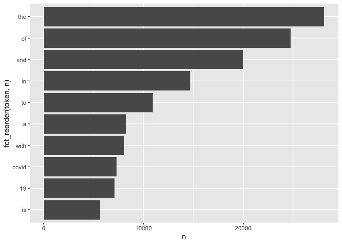
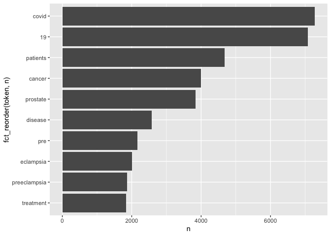
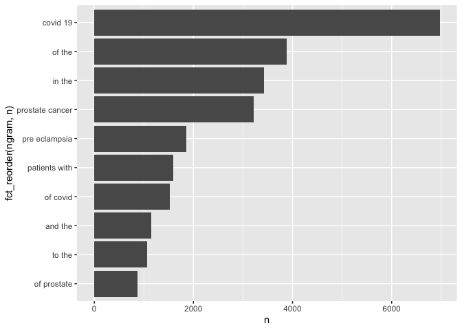

assignment03
================
sl
2022-11-03

``` r
setwd("/Users/samuellu/Desktop/PM566/GitHub/pm566-fall2022-labs_Sam/Assignment/assignment03/")
```

# APIs

## Using the NCBI API, look for papers that show up under the term “sars-cov-2 trial vaccine.” Look for the data in the pubmed database, and then retrieve the details of the paper as shown in lab 7. How many papers were you able to find?

``` r
# Downloading the website
website <- xml2::read_html("https://pubmed.ncbi.nlm.nih.gov/?term=sars-cov-2%20trial%20vaccine")

# Finding the counts
counts <- xml2::xml_find_first(website, "/html/body/main/div[9]/div[2]/div[2]/div[1]/div[1]")

# Turning it into text
counts <- as.character(counts)

# Extracting the data using regex
stringr::str_extract(counts, "[0-9,]+")
```

    ## [1] "4,006"

I was able to find 4,005 papers that show up under the term “sars-cov-2
trial vaccine.”

## Using the list of pubmed ids you retrieved, download each papers’ details using the query parameter rettype = abstract. If you get more than 250 ids, just keep the first 250.

``` r
library(httr)
query_ids <- GET(
  url   = "https://eutils.ncbi.nlm.nih.gov/entrez/eutils/esearch.fcgi",
  query = list(
    db      = "pubmed",
    term = "sars-cov-2 trial vaccine.",
    rettype = "abstract",
    retmax  = 250)
)

# Extracting the content of the response of GET
ids <- httr::content(query_ids)
```

### Get PubMed ID number

``` r
# Turn the result into a character vector
ids <- as.character(ids)

# Find all the ids 
ids <- stringr::str_extract_all(ids, "<Id>[[:digit:]]+</Id>")[[1]]

# Remove all the leading and trailing <Id> </Id>. Make use of "|"
ids <- stringr::str_remove_all(ids, "</?Id>")

head(ids)
```

    ## [1] "36322837" "36320825" "36314847" "36307830" "36305195" "36301821"

``` r
publications <- GET(
  url   = "https://eutils.ncbi.nlm.nih.gov/entrez/eutils/efetch.fcgi",
  query = list(
    db  = "pubmed",
    id  = paste(ids,collapse = ","),
  retmax = 250,
  rettype = "abstract"
    )
)
# Extracting the content of the response of GET
publications <- httr::content(publications)
```

## Create a dataset containing the following:

PubMed ID number, Title of the paper, Name of the journal where it was
published, Publication date, and Abstract of the paper (if any).

``` r
pub_char_list <- xml2::xml_children(publications)
pub_char_list <- sapply(pub_char_list, as.character)
```

### Get titles

``` r
titles <- str_extract(pub_char_list, "<ArticleTitle>[[:print:][:space:]]+</ArticleTitle>")
#titles[[1]]
titles <- str_remove_all(titles, "</?[[:alnum:]- =\"]+>")
titles[[1]]
```

    ## [1] "Covid-19 Vaccine Protection among Children and Adolescents in Qatar."

### Get name of the journal where it was published

``` r
names <- str_extract(pub_char_list, "<Title>[[:print:][:space:]]+</Title>")
#names[[1]]
names <- str_remove_all(names, "</?[[:alnum:]- =\"]+>")
names[[1]]
```

    ## [1] "The New England journal of medicine"

### Get publication date

``` r
years <- str_extract(pub_char_list, "<Year>[[:print:]]+</Year>")
#years[[1]]
years <- str_remove_all(years, "</?[[:alnum:]- =\"]+>")
years[[1]]
```

    ## [1] "2022"

``` r
months <- str_extract(pub_char_list, "<Month>[[:print:]]+</Month>")
#months[[1]]
months <- str_remove_all(months, "</?[[:alnum:]- =\"]+>")
months[[1]]
```

    ## [1] "11"

``` r
days <- str_extract(pub_char_list, "<Day>[[:print:]]+</Day>")
#days[[1]]
days <- str_remove_all(days, "</?[[:alnum:]- =\"]+>")
days[[1]]
```

    ## [1] "02"

### Get abstracts

``` r
abstracts <- str_extract(pub_char_list, "<Abstract>[[:print:][:space:]]+</Abstract>")
#abstracts[[1]]
abstracts <- str_remove_all(abstracts, "</?[[:alnum:]- =\"]+>") 
#abstracts[[1]]
abstracts <- str_replace_all(abstracts, "[[:space:]]+"," ")
abstracts[[1]]
```

    ## [1] " The BNT162b2 vaccine against coronavirus disease 2019 (Covid-19) has been authorized for use in children 5 to 11 years of age and adolescents 12 to 17 years of age but in different antigen doses. We assessed the real-world effectiveness of the BNT162b2 vaccine against infection with severe acute respiratory syndrome coronavirus 2 (SARS-CoV-2) among children and adolescents in Qatar. To compare the incidence of SARS-CoV-2 infection in the national cohort of vaccinated participants with the incidence in the national cohort of unvaccinated participants, we conducted three matched, retrospective, target-trial, cohort studies - one assessing data obtained from children 5 to 11 years of age after the B.1.1.529 (omicron) variant became prevalent and two assessing data from adolescents 12 to 17 years of age before the emergence of the omicron variant (pre-omicron study) and after the omicron variant became prevalent. Associations were estimated with the use of Cox proportional-hazards regression models. Among children, the overall effectiveness of the 10-μg primary vaccine series against infection with the omicron variant was 25.7% (95% confidence interval [CI], 10.0 to 38.6). Effectiveness was highest (49.6%; 95% CI, 28.5 to 64.5) right after receipt of the second dose but waned rapidly thereafter and was negligible after 3 months. Effectiveness was 46.3% (95% CI, 21.5 to 63.3) among children 5 to 7 years of age and 16.6% (95% CI, -4.2 to 33.2) among those 8 to 11 years of age. Among adolescents, the overall effectiveness of the 30-μg primary vaccine series against infection with the omicron variant was 30.6% (95% CI, 26.9 to 34.1), but many adolescents had been vaccinated months earlier. Effectiveness waned over time since receipt of the second dose. Effectiveness was 35.6% (95% CI, 31.2 to 39.6) among adolescents 12 to 14 years of age and 20.9% (95% CI, 13.8 to 27.4) among those 15 to 17 years of age. In the pre-omicron study, the overall effectiveness of the 30-μg primary vaccine series against SARS-CoV-2 infection among adolescents was 87.6% (95% CI, 84.0 to 90.4) and waned relatively slowly after receipt of the second dose. Vaccination in children was associated with modest, rapidly waning protection against omicron infection. Vaccination in adolescents was associated with stronger, more durable protection, perhaps because of the larger antigen dose. (Funded by Weill Cornell Medicine-Qatar and others.). Copyright © 2022 Massachusetts Medical Society. "

### Create my dataset:

``` r
database <- data.frame(
  PubMedId = ids,
  Title    = titles,
  Journal  = names,
  Year     = years,
  Month    = months,
  Day      = days,
  Abstract = abstracts
)
knitr::kable(database[1:3,], align = "lllllll", caption = "Some papers about sars-cov-2 trial vaccine")
```

| PubMedId | Title                                                                                                                                                                                                                 | Journal                             | Year | Month | Day | Abstract                                                                                                                                                                                                                                                                                                                                                                                                                                                                                                                                                                                                                                                                                                                                                                                                                                                                                                                                                                                                                                                                                                                                                                                                                                                                                                                                                                                                                                                                                                                                                                                                                                                                                                                                                                                                                                                                                                                                                                                                                                                                                                                                                                                                                                                                                                                                                                                                                                                                                                                                                                                                                                                                                                                                                                                                                                                                                                                                                                                                                                                                                                                                                                                                                                                                                                                                                                                                                                                                                                                                                                                                                                                                                                                                                                           |
|:---------|:----------------------------------------------------------------------------------------------------------------------------------------------------------------------------------------------------------------------|:------------------------------------|:-----|:------|:----|:-----------------------------------------------------------------------------------------------------------------------------------------------------------------------------------------------------------------------------------------------------------------------------------------------------------------------------------------------------------------------------------------------------------------------------------------------------------------------------------------------------------------------------------------------------------------------------------------------------------------------------------------------------------------------------------------------------------------------------------------------------------------------------------------------------------------------------------------------------------------------------------------------------------------------------------------------------------------------------------------------------------------------------------------------------------------------------------------------------------------------------------------------------------------------------------------------------------------------------------------------------------------------------------------------------------------------------------------------------------------------------------------------------------------------------------------------------------------------------------------------------------------------------------------------------------------------------------------------------------------------------------------------------------------------------------------------------------------------------------------------------------------------------------------------------------------------------------------------------------------------------------------------------------------------------------------------------------------------------------------------------------------------------------------------------------------------------------------------------------------------------------------------------------------------------------------------------------------------------------------------------------------------------------------------------------------------------------------------------------------------------------------------------------------------------------------------------------------------------------------------------------------------------------------------------------------------------------------------------------------------------------------------------------------------------------------------------------------------------------------------------------------------------------------------------------------------------------------------------------------------------------------------------------------------------------------------------------------------------------------------------------------------------------------------------------------------------------------------------------------------------------------------------------------------------------------------------------------------------------------------------------------------------------------------------------------------------------------------------------------------------------------------------------------------------------------------------------------------------------------------------------------------------------------------------------------------------------------------------------------------------------------------------------------------------------------------------------------------------------------------------------------------------------|
| 36322837 | Covid-19 Vaccine Protection among Children and Adolescents in Qatar.                                                                                                                                                  | The New England journal of medicine | 2022 | 11    | 02  | The BNT162b2 vaccine against coronavirus disease 2019 (Covid-19) has been authorized for use in children 5 to 11 years of age and adolescents 12 to 17 years of age but in different antigen doses. We assessed the real-world effectiveness of the BNT162b2 vaccine against infection with severe acute respiratory syndrome coronavirus 2 (SARS-CoV-2) among children and adolescents in Qatar. To compare the incidence of SARS-CoV-2 infection in the national cohort of vaccinated participants with the incidence in the national cohort of unvaccinated participants, we conducted three matched, retrospective, target-trial, cohort studies - one assessing data obtained from children 5 to 11 years of age after the B.1.1.529 (omicron) variant became prevalent and two assessing data from adolescents 12 to 17 years of age before the emergence of the omicron variant (pre-omicron study) and after the omicron variant became prevalent. Associations were estimated with the use of Cox proportional-hazards regression models. Among children, the overall effectiveness of the 10-μg primary vaccine series against infection with the omicron variant was 25.7% (95% confidence interval \[CI\], 10.0 to 38.6). Effectiveness was highest (49.6%; 95% CI, 28.5 to 64.5) right after receipt of the second dose but waned rapidly thereafter and was negligible after 3 months. Effectiveness was 46.3% (95% CI, 21.5 to 63.3) among children 5 to 7 years of age and 16.6% (95% CI, -4.2 to 33.2) among those 8 to 11 years of age. Among adolescents, the overall effectiveness of the 30-μg primary vaccine series against infection with the omicron variant was 30.6% (95% CI, 26.9 to 34.1), but many adolescents had been vaccinated months earlier. Effectiveness waned over time since receipt of the second dose. Effectiveness was 35.6% (95% CI, 31.2 to 39.6) among adolescents 12 to 14 years of age and 20.9% (95% CI, 13.8 to 27.4) among those 15 to 17 years of age. In the pre-omicron study, the overall effectiveness of the 30-μg primary vaccine series against SARS-CoV-2 infection among adolescents was 87.6% (95% CI, 84.0 to 90.4) and waned relatively slowly after receipt of the second dose. Vaccination in children was associated with modest, rapidly waning protection against omicron infection. Vaccination in adolescents was associated with stronger, more durable protection, perhaps because of the larger antigen dose. (Funded by Weill Cornell Medicine-Qatar and others.). Copyright © 2022 Massachusetts Medical Society.                                                                                                                                                                                                                                                                                                                                                                                                                                                                                                                                                                                                                                                                                                                                                                                                                                                                                                                                                                                                                                                                                                                                                                                     |
| 36320825 | Withholding methotrexate after vaccination with ChAdOx1 nCov19 in patients with rheumatoid or psoriatic arthritis in India (MIVAC I and II): results of two, parallel, assessor-masked, randomised controlled trials. | The Lancet. Rheumatology            | 2022 | 11    | 02  | There is a necessity for an optimal COVID-19 vaccination strategy for vulnerable population groups, including people with autoimmune inflammatory arthritis on immunosuppressants such as methotrexate, which inhibit vaccine-induced immunity against SARS-CoV-2. Thus, we aimed to assess the effects of withholding methotrexate for 2 weeks after each dose of ChAdOx1 nCov-19 (Oxford-AstraZeneca) vaccine (MIVAC I) or only after the second dose of vaccine (MIVAC II) compared with continuation of methotrexate, in terms of post-vaccination antibody titres and disease flare rates. MIVAC I and II were two parallel, independent, assessor-masked, randomised trials. The trials were done at a single centre (Dr Shenoy’s Centre for Arthritis and Rheumatism Excellence; Kochi, India) in people with either rheumatoid arthritis or psoriatic arthritis with stable disease activity, who had been on a fixed dose of methotrexate for the preceding 6 weeks. Those with previous COVID-19 or who were positive for anti-SARS-CoV-2 nucleocapsid antibodies were excluded from the trials. People on high-dose corticosteroids and rituximab were also excluded, whereas other disease-modifying antirheumatic drugs were allowed. In MIVAC I, participants were randomly assigned (1:1) to stop methotrexate treatment for 2 weeks after each vaccine dose or to continue methotrexate treatment. In MIVAC II, participants who had continued methotrexate during the first dose of vaccine were randomly assigned (1:1) to withhold methotrexate for 2 weeks after the second dose of vaccine or to continue to take methotrexate. The treating physician was masked to the group assignments. The primary outcome for both MIVAC I and MIVAC II was the titre (absolute value) of anti-receptor binding domain (RBD) antibody measured 4 weeks after the second dose of vaccine. All analyses were done per protocol. The trials were registered with the Clinical Trials Registry- India, number CTRI/2021/07/034639 (MIVAC I) and CTRI/2021/07/035307 (MIVAC II). Between July 6 and Dec 15, 2021, participants were recruited to the trials. In MIVAC I, 250 participants were randomly assigned and 158 completed the study as per the protocol (80 in the methotrexate hold group and 78 in the control group; 148 \[94%\] were women and 10 \[6%\] were men). The median post-vaccination antibody titres in the methotrexate hold group were significantly higher compared with the control group (2484·0 IU/mL, IQR 1050·0-4388·8 vs 1147·5 IU/mL, 433·5-2360·3; p=0·0014). In MIVAC II, 178 participants were randomly assigned and 157 completed the study per protocol (76 in the methotrexate hold group and 81 in the control group; 135 \[86%\] were women and 22 \[14%\] were men). The methotrexate hold group had higher post-vaccination antibody titres compared with the control group (2553·5 IU/ml, IQR 1792·5-4823·8 vs 990·5, 356·1-2252·5; p\<0·0001). There were no reports of any serious adverse events during the trial period. Withholding methotrexate after both ChAdOx1 nCov-19 vaccine doses and after only the second dose led to higher anti-RBD antibody titres compared with continuation of methotrexate. However, withholding methotrexate only after the second vaccine dose resulted in a similar humoral response to holding methotrexate after both vaccine doses, without an increased risk of arthritis flares. Hence, interruption of methotrexate during the second dose of ChAdOx1 nCov-19 vaccine appears to be a safe and effective strategy to improve the antibody response in patients with rheumatoid or psoriatic arthritis. Indian Rheumatology Association. © 2022 Elsevier Ltd. All rights reserved. |
| 36314847 | An online community peer support intervention to promote COVID-19 vaccine information among essential workers: a randomized trial.                                                                                    | Annals of medicine                  | 2022 | 11    | 02  | Vaccine hesitancy is still rampant in the United States, including health care personnel. Vaccination of frontline essential workers (e.g. health care workers) is very important, especially during a pandemic. We tested the efficacy of a 4-week online, peer-led intervention (Harnessing Online Peer Education) to promote requests for COVID-19 vaccine information among essential workers. Participants (N = 120) and peer leaders (N = 12) were recruited through online advertisements from July 23 to August 20, 2021. Eligibility criteria included: 18 years or older, U.S. resident, English speaker, part of phase 1a or 1 b of COVID-19 vaccine rollout (e.g. frontline essential workers), hadn’t received a COVID-19 vaccine but able to receive one. This was a parallel assignment randomised trial. STATA was used to create a randomisation using a random number generator so that all possible assignments of participants and peer leaders to groups were equally likely. Participants were randomly assigned to intervention or control arms that consisted of two private, hidden Facebook groups, each with 30 participants. Peer leaders were randomly assigned to an intervention group, each with six peer leaders. Participants in the intervention arm were randomly assigned to three peer leaders. Participants were blinded after assignment. Peer leaders were tasked with reaching out to their assigned participants at least three times each week. Participants completed a baseline and a post intervention survey. The study is registered on ClinicalTrials.org under identifier NCT04376515 and is no longer recruiting. This work was supported by the NIAID under grant 5R01AI132030-05. A total of 101 participants analysed (50 intervention and 51 control). Six people in the intervention group and 0 people in the control group requested vaccine information. Ten people in the intervention group and six people in the control group provided proof of vaccination. The odds of requesting vaccine information in the intervention group was 13 times that in the control group (95% confidence interval: (1.5, 1772), p-value = 0.015). Thirty-seven participants in the intervention group and 31 in the control group were engaged at some point during the study. Results suggest peer-led online community groups may help to disseminate health information, aid public health efforts, and combat vaccine hesitancy. Key MessagesThe odds of requesting vaccine information was 13 times in the intervention group.Peer-led online communities may help to disseminate information and aid public health efforts to combat vaccine hesitancy.                                                                                                                                                                                                                                                                                                                                                                                                                                                                                                                                                                                                                                                                                                                                                                                                                                                                                                                                                                                                                                                                      |

Some papers about sars-cov-2 trial vaccine

I was able to get Year, Month, and Day. However, I still have to find
out a way to merge them.

# Text Mining

``` r
library(tidytext)
library(tidyverse)
```

    ## ── Attaching packages ─────────────────────────────────────── tidyverse 1.3.2 ──
    ## ✔ ggplot2 3.3.6      ✔ purrr   0.3.5 
    ## ✔ tibble  3.1.8      ✔ dplyr   1.0.10
    ## ✔ tidyr   1.2.1      ✔ forcats 0.5.2 
    ## ✔ readr   2.1.3      
    ## ── Conflicts ────────────────────────────────────────── tidyverse_conflicts() ──
    ## ✖ dplyr::between()        masks data.table::between()
    ## ✖ dplyr::filter()         masks stats::filter()
    ## ✖ dplyr::first()          masks data.table::first()
    ## ✖ readr::guess_encoding() masks rvest::guess_encoding()
    ## ✖ dplyr::lag()            masks stats::lag()
    ## ✖ dplyr::last()           masks data.table::last()
    ## ✖ purrr::transpose()      masks data.table::transpose()

``` r
library(dplyr)
library(ggplot2)
library(forcats)
```

## Read in the data

``` r
if (!file.exists("pubmed.csv"))
  download.file(
    url = "https://raw.githubusercontent.com/USCbiostats/data-science-data/master/03_pubmed/pubmed.csv",
    destfile = "pubmed.csv",
    method   = "libcurl",
    timeout  = 60
    )
pm <- read.csv("pubmed.csv")
#dim(pm)
str(pm)
```

    ## 'data.frame':    3241 obs. of  2 variables:
    ##  $ abstract: chr  "Background and aims: Many patients with coronavirus disease 2019 (COVID-19) have underlying cardiovascular (CV)"| __truncated__ "Introduction: Contradictory data have been reported on the incidence of stroke in patients with COVID-19 and th"| __truncated__ "This article aims at collecting all information needed for dentists regarding the COVID-19 pandemic throughout "| __truncated__ "OBJECTIVE. The objective of our study was to determine the misdiagnosis rate of radiologists for coronavirus di"| __truncated__ ...
    ##  $ term    : chr  "covid" "covid" "covid" "covid" ...

``` r
pm <- as_tibble(pm)
pm
```

    ## # A tibble: 3,241 × 2
    ##    abstract                                                                term 
    ##    <chr>                                                                   <chr>
    ##  1 "Background and aims: Many patients with coronavirus disease 2019 (COV… covid
    ##  2 "Introduction: Contradictory data have been reported on the incidence … covid
    ##  3 "This article aims at collecting all information needed for dentists r… covid
    ##  4 "OBJECTIVE. The objective of our study was to determine the misdiagnos… covid
    ##  5 "Background: Much of the focus regarding the global pandemic of corona… covid
    ##  6 "The World Health Organization (WHO) has issued a warning that, althou… covid
    ##  7 "The coronavirus disease (COVID-19) has spread all around the world in… covid
    ##  8 "Objective: The novel severe acute respiratory syndrome coronavirus 2 … covid
    ##  9 "COVID-19 has been declared a global pandemic by the World Health Orga… covid
    ## 10 "Background: Coronavirus disease 2019 (COVID-19) is a novel infectious… covid
    ## # … with 3,231 more rows

## 1. Tokenize the abstracts and count the number of each token. Do you see anything interesting? Does removing stop words change what tokens appear as the most frequent? What are the 5 most common tokens for each search term after removing stopwords?

``` r
pm %>%
  unnest_tokens(token, abstract) %>%
  count(token) %>%
  top_n(10, n) %>%
  ggplot(aes(n, fct_reorder(token, n))) +
  geom_col()
```

<!-- -->

I can only find “covid” and “19” which are interesting because there are
lots of stop words. It would be nice to remove stop words.

``` r
pm %>%
  unnest_tokens(token, abstract) %>%
  anti_join(stop_words, by = c("token" = "word")) %>%
  count(token) %>%
  top_n(10, n) %>%
  ggplot(aes(n, fct_reorder(token, n))) +
  geom_col()
```

<!-- -->

After removing stop words, the word “covid” became the most frequent
word and we can also find there are other interesting words appeared to
the top 10 list.

``` r
pm %>%
  unnest_tokens(token, abstract) %>%
  group_by(term) %>%
  count(token, sort = TRUE) %>%
  filter(!(token %in% stop_words$word) & !grepl(pattern = "^[0-9]+$", x = token)) %>%
  top_n(5, n) %>%
  arrange(term, desc(n)) %>%
knitr::kable()
```

| term            | token        |    n |
|:----------------|:-------------|-----:|
| covid           | covid        | 7275 |
| covid           | patients     | 2293 |
| covid           | disease      |  943 |
| covid           | pandemic     |  800 |
| covid           | coronavirus  |  647 |
| covid           | health       |  647 |
| cystic fibrosis | fibrosis     |  867 |
| cystic fibrosis | cystic       |  862 |
| cystic fibrosis | cf           |  625 |
| cystic fibrosis | patients     |  586 |
| cystic fibrosis | disease      |  400 |
| meningitis      | patients     |  446 |
| meningitis      | meningitis   |  429 |
| meningitis      | meningeal    |  219 |
| meningitis      | csf          |  206 |
| meningitis      | clinical     |  187 |
| preeclampsia    | pre          | 2038 |
| preeclampsia    | eclampsia    | 2005 |
| preeclampsia    | preeclampsia | 1863 |
| preeclampsia    | women        | 1196 |
| preeclampsia    | pregnancy    |  969 |
| prostate cancer | cancer       | 3840 |
| prostate cancer | prostate     | 3832 |
| prostate cancer | patients     |  934 |
| prostate cancer | treatment    |  926 |
| prostate cancer | disease      |  652 |

After removing stop words, I created a list with the 5 most common
tokens for each search term. We can understand that each search term
contains its own related words from this list.

2.  Tokenize the abstracts into bigrams. Find the 10 most common bigram
    and visualize them with ggplot2.

``` r
pm %>%
  unnest_ngrams(ngram, abstract, n = 2) %>%
  count(ngram, sort = TRUE) %>%
  top_n(10, n) %>%
  ggplot(aes(n, fct_reorder(ngram, n))) +
  geom_col()
```

<!-- -->

Althought we may tokenize the abstracts into bigrams, I was wondering
whether I can remove those stop words in bigrams.

3.  Calculate the TF-IDF value for each word-search term combination.
    (here you want the search term to be the “document”) What are the 5
    tokens from each search term with the highest TF-IDF value? How are
    the results different from the answers you got in question 1?

``` r
pm %>%
  unnest_tokens(token, abstract) %>%
  group_by(term) %>%
  count(token, sort = TRUE) %>%
  filter(!(token %in% stop_words$word)) %>%
  top_n(5, n) %>%
  bind_tf_idf(token, term, n) %>%
  arrange(term, desc(tf_idf)) %>%
knitr::kable()
```

| term            | token        |    n |        tf |       idf |    tf_idf |
|:----------------|:-------------|-----:|----------:|----------:|----------:|
| covid           | covid        | 7275 | 0.3965442 | 1.6094379 | 0.6382133 |
| covid           | 19           | 7035 | 0.3834623 | 1.6094379 | 0.6171588 |
| covid           | pandemic     |  800 | 0.0436062 | 1.6094379 | 0.0701815 |
| covid           | patients     | 2293 | 0.1249864 | 0.2231436 | 0.0278899 |
| covid           | disease      |  943 | 0.0514009 | 0.5108256 | 0.0262569 |
| cystic fibrosis | fibrosis     |  867 | 0.2595808 | 1.6094379 | 0.4177792 |
| cystic fibrosis | cystic       |  862 | 0.2580838 | 1.6094379 | 0.4153699 |
| cystic fibrosis | cf           |  625 | 0.1871257 | 1.6094379 | 0.3011673 |
| cystic fibrosis | disease      |  400 | 0.1197605 | 0.5108256 | 0.0611767 |
| cystic fibrosis | patients     |  586 | 0.1754491 | 0.2231436 | 0.0391503 |
| meningitis      | meningitis   |  429 | 0.2885003 | 1.6094379 | 0.4643234 |
| meningitis      | meningeal    |  219 | 0.1472764 | 1.6094379 | 0.2370322 |
| meningitis      | csf          |  206 | 0.1385340 | 1.6094379 | 0.2229618 |
| meningitis      | clinical     |  187 | 0.1257566 | 1.6094379 | 0.2023974 |
| meningitis      | patients     |  446 | 0.2999328 | 0.2231436 | 0.0669281 |
| preeclampsia    | pre          | 2038 | 0.2525090 | 1.6094379 | 0.4063975 |
| preeclampsia    | eclampsia    | 2005 | 0.2484203 | 1.6094379 | 0.3998170 |
| preeclampsia    | preeclampsia | 1863 | 0.2308264 | 1.6094379 | 0.3715008 |
| preeclampsia    | women        | 1196 | 0.1481849 | 1.6094379 | 0.2384943 |
| preeclampsia    | pregnancy    |  969 | 0.1200595 | 1.6094379 | 0.1932283 |
| prostate cancer | cancer       | 3840 | 0.3770621 | 1.6094379 | 0.6068580 |
| prostate cancer | prostate     | 3832 | 0.3762765 | 1.6094379 | 0.6055937 |
| prostate cancer | treatment    |  926 | 0.0909269 | 1.6094379 | 0.1463413 |
| prostate cancer | disease      |  652 | 0.0640220 | 0.5108256 | 0.0327041 |
| prostate cancer | patients     |  934 | 0.0917125 | 0.2231436 | 0.0204651 |

This list shows the top 5 tokens from each search term with the highest
TF-IDF value. The results are more relevant to their terms and it can
can be easier to target their main tokens with one glance than the
method from question 1.
