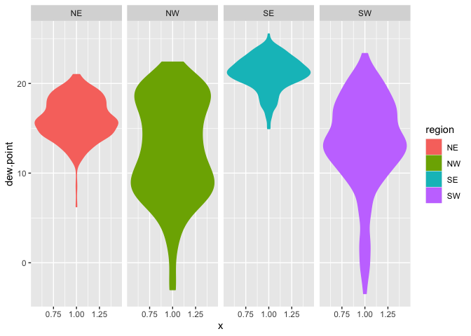
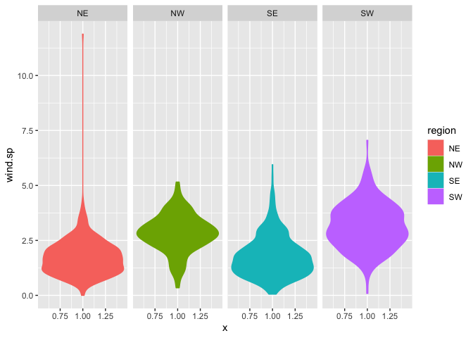
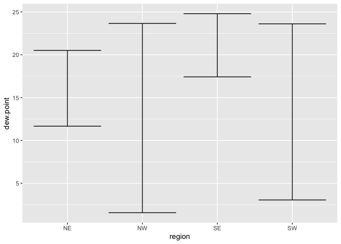
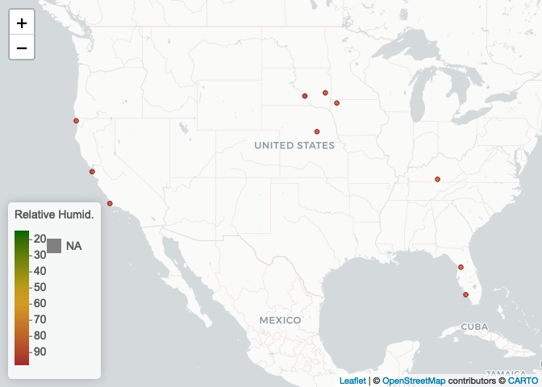

Lab04
================
sl
2022-09-17

``` r
library(webshot)
library(lubridate)
```

    ## 
    ## Attaching package: 'lubridate'

    ## The following objects are masked from 'package:base':
    ## 
    ##     date, intersect, setdiff, union

``` r
library(tidyverse)
```

    ## ── Attaching packages
    ## ───────────────────────────────────────
    ## tidyverse 1.3.2 ──

    ## ✔ ggplot2 3.3.6     ✔ purrr   0.3.4
    ## ✔ tibble  3.1.8     ✔ dplyr   1.0.9
    ## ✔ tidyr   1.2.0     ✔ stringr 1.4.1
    ## ✔ readr   2.1.2     ✔ forcats 0.5.2
    ## ── Conflicts ────────────────────────────────────────── tidyverse_conflicts() ──
    ## ✖ lubridate::as.difftime() masks base::as.difftime()
    ## ✖ lubridate::date()        masks base::date()
    ## ✖ dplyr::filter()          masks stats::filter()
    ## ✖ lubridate::intersect()   masks base::intersect()
    ## ✖ dplyr::lag()             masks stats::lag()
    ## ✖ lubridate::setdiff()     masks base::setdiff()
    ## ✖ lubridate::union()       masks base::union()

``` r
library(data.table)
```

    ## 
    ## Attaching package: 'data.table'
    ## 
    ## The following objects are masked from 'package:dplyr':
    ## 
    ##     between, first, last
    ## 
    ## The following object is masked from 'package:purrr':
    ## 
    ##     transpose
    ## 
    ## The following objects are masked from 'package:lubridate':
    ## 
    ##     hour, isoweek, mday, minute, month, quarter, second, wday, week,
    ##     yday, year

``` r
library(leaflet)
```

## Step1: Read in the data

``` r
if (!file.exists("met_all.gz"))
  download.file(
    url = "https://raw.githubusercontent.com/USCbiostats/data-science-data/master/02_met/met_all.gz",
    destfile = "met_all.gz",
    method   = "libcurl",
    timeout  = 60
    )
met <- data.table::fread("met_all.gz")
```

## Step2: Prep the Data

Remove temperatures less than -17C. Make sure there are no missing data
in the key variables coded as 9999, 999, etc

``` r
met <- met[met$temp >= -17][elev == 9999.0, elev:=NA]
```

Generate a date variable using the functions as.Date() (hint: You will
need the following to create a date paste(year, month, day, sep = “-”)).

``` r
met <- met[ , ymd := as.Date(paste(year, month, day, sep = "-"))]
```

Using the data.table::week function, keep the observations of the first
week of the month.

``` r
met[, table(week(ymd))]
```

    ## 
    ##     31     32     33     34     35 
    ## 297260 521605 527924 523847 446576

``` r
met <- met[week(ymd) == 31]
```

Compute the mean by station of the variables temp, rh, wind.sp,
vis.dist, dew.point, lat, lon, and elev.

``` r
met[, .(
  temp = max(temp, na.rm = T),
  rh = max(rh, na.rm = T),
  wind.sp = max(wind.sp, na.rm = T),
  vis.dist = max(vis.dist, na.rm = T),
  dew.point = max(dew.point, na.rm = T),
  lat = max(lat, na.rm = T),
  lon = max(lon, na.rm = T),
  elev = max(elev, na.rm = T)
)]
```

    ##    temp  rh wind.sp vis.dist dew.point    lat     lon elev
    ## 1:   47 100    20.6   144841        29 48.941 -68.313 4113

Great! No more 9999s in our dataset.

``` r
met_avg <- met[, .(
  temp = mean(temp, na.rm = T),
  rh = mean(rh, na.rm = T),
  wind.sp = mean(wind.sp, na.rm = T),
  vis.dist = mean(vis.dist, na.rm = T),
  dew.point = mean(dew.point, na.rm = T),
  lat = mean(lat, na.rm = T),
  lon = mean(lon, na.rm = T),
  elev = mean(elev, na.rm = T)
), by = "USAFID"]
```

Create a region variable for NW, SW, NE, SE based on lon = -98.00 and
lat = 39.71 degrees

``` r
met_avg[, region := fifelse(lon >= -98 & lat > 39.71, "NE",
                fifelse(lon < -98 & lat > 39.71, "NW",
                fifelse(lon < -98 & lat <= 39.71, "SW","SE")))
   ]
table(met_avg$region)
```

    ## 
    ##  NE  NW  SE  SW 
    ## 484 146 649 297

Create a categorical variable for elevation as in the lecture slides

``` r
met_avg[, elev_cat := fifelse(elev > 252, "high", "low")]
```

## 3. make violin plots of dew point temp by region

``` r
met_avg[!is.na(region)] %>% 
  ggplot() + 
  geom_violin(mapping = aes(x = 1, y = dew.point, color=region, fill = region)) + 
  facet_wrap(~ region, nrow = 1)
```

    ## Warning: Removed 1 rows containing non-finite values (stat_ydensity).

<!-- -->

The highest dew point temperatures are reported in the southeast.

``` r
met_avg[!is.na(region) & !is.na(wind.sp)] %>% 
  ggplot() + 
  geom_violin(mapping = aes(y = wind.sp, x = 1, color=region, fill = region)) +
  facet_wrap(~ region, nrow = 1)
```

<!-- -->

The highest wind.sp is reported in the northeast.

## 4. Use geom_point with geom_smooth to examine the association between dew point temperature and wind speed by region

Colour points by region Make sure to deal with NA category Fit a linear
regression line by region Describe what you observe in the graph

``` r
met_avg[!is.na(region) & !is.na(wind.sp)] %>% 
  ggplot(mapping = aes(x = wind.sp, y = dew.point)) + 
  geom_point(mapping = aes(color = region)) + 
  geom_smooth(method =lm, mapping = aes(linetype = region)) +
  facet_wrap(~ region, nrow = 2)
```

    ## `geom_smooth()` using formula 'y ~ x'

    ## Warning: Removed 1 rows containing non-finite values (stat_smooth).

    ## Warning: Removed 1 rows containing missing values (geom_point).

<!-- -->

Comment on these results

## 5. Use geom_bar to create barplots of the weather stations by elevation category coloured by region

## 6. Use stat_summary to examine mean dew point and wind speed by region with standard deviation error bars

``` r
met_avg[!is.na(dew.point)] %>%
  ggplot(mapping = aes(x = region, y = dew.point)) + 
    stat_summary(fun.data = "mean_sdl", geom = "errorbar")
```

<!-- -->

I can show with means or with error bars, but I’d like to show both!

## 7. Make a map showing the spatial trend in relative h in the US

``` r
rh.pal <- colorNumeric(c('darkgreen','goldenrod','brown'), domain=met_avg$rh)
rh.pal
```

    ## function (x) 
    ## {
    ##     if (length(x) == 0 || all(is.na(x))) {
    ##         return(pf(x))
    ##     }
    ##     if (is.null(rng)) 
    ##         rng <- range(x, na.rm = TRUE)
    ##     rescaled <- scales::rescale(x, from = rng)
    ##     if (any(rescaled < 0 | rescaled > 1, na.rm = TRUE)) 
    ##         warning("Some values were outside the color scale and will be treated as NA")
    ##     if (reverse) {
    ##         rescaled <- 1 - rescaled
    ##     }
    ##     pf(rescaled)
    ## }
    ## <bytecode: 0x7fa43ae937b0>
    ## <environment: 0x7fa43ae94d90>
    ## attr(,"colorType")
    ## [1] "numeric"
    ## attr(,"colorArgs")
    ## attr(,"colorArgs")$na.color
    ## [1] "#808080"

Use addMarkers to include the top 10 places in relative h (hint: this
will be useful rank(-rh) \<= 10)

``` r
met_avg[rank(-rh)<= 10]
```

    ##     USAFID     temp       rh   wind.sp  vis.dist dew.point      lat        lon
    ##  1: 720379 21.47634 91.98783 3.3273256  9565.011  19.90323 36.85500  -84.85600
    ##  2: 720624 21.17226 94.86840 3.6029279 16031.801  20.20582 44.01600  -97.08600
    ##  3: 720646 14.61373 96.14343 2.7878193  4305.788  13.97451 37.51300 -122.50100
    ##  4: 722038 26.88414 92.79511 2.8909722 13964.862  25.52966 26.15496  -81.77500
    ##  5: 723930 12.94467 94.48180 2.0378173  5185.784  11.97908 34.71700 -120.56600
    ##  6: 724737 25.86219 92.24941 0.6226148 13076.251  24.31095 28.81700  -82.31700
    ##  7: 725495 21.66667 92.04836 2.4371560 15551.776  20.14222 43.20800  -95.83300
    ##  8: 725513 21.61979 92.70759 3.1020833 13254.417  20.22639 40.89300  -97.99700
    ##  9: 725946 15.79515 92.65354 2.2703883  8310.199  14.55388 41.78000 -124.23601
    ## 10: 726530 22.88160 97.40711 2.4968750 12453.917  22.38889 43.76700  -99.31801
    ##           elev region elev_cat
    ##  1: 294.000000     SE     high
    ##  2: 523.000000     NE     high
    ##  3:  20.000000     SW      low
    ##  4:   6.896552     SE      low
    ##  5: 112.000000     SW      low
    ##  6:  15.000000     SE      low
    ##  7: 433.000000     NE     high
    ##  8: 550.000000     NE     high
    ##  9:  17.000000     NW      low
    ## 10: 517.000000     NW     high

``` r
top10rh <- met_avg[order(-rh)][1:10]
```

``` r
rhmap <- leaflet(top10rh) %>% 
  # The looks of the Map
  addProviderTiles('CartoDB.Positron') %>% 
  # Some circles
  addCircles(
    lat = ~lat, lng=~lon,
  # HERE IS OUR PAL!
    label = ~paste0(rh), color = ~ rh.pal(rh),
    opacity = 1, fillOpacity = 1, radius = 500
    ) %>%
  # And a pretty legend
  addLegend('bottomleft', pal=rh.pal, values=met_avg$rh,
          title='Relative Humid.', opacity=1)
rhmap
```

<!-- -->
