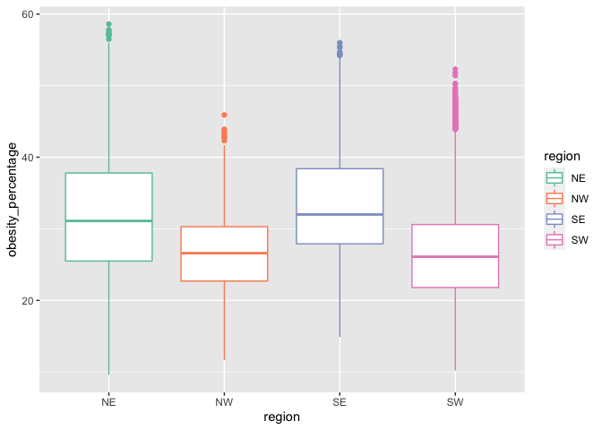

mid-term
================
sl
2022-10-17

``` r
library(lubridate)
```

    ## 
    ## Attaching package: 'lubridate'

    ## The following objects are masked from 'package:base':
    ## 
    ##     date, intersect, setdiff, union

``` r
library(tidyverse)
```

    ## ── Attaching packages
    ## ───────────────────────────────────────
    ## tidyverse 1.3.2 ──

    ## ✔ ggplot2 3.3.6     ✔ purrr   0.3.4
    ## ✔ tibble  3.1.8     ✔ dplyr   1.0.9
    ## ✔ tidyr   1.2.0     ✔ stringr 1.4.1
    ## ✔ readr   2.1.2     ✔ forcats 0.5.2
    ## ── Conflicts ────────────────────────────────────────── tidyverse_conflicts() ──
    ## ✖ lubridate::as.difftime() masks base::as.difftime()
    ## ✖ lubridate::date()        masks base::date()
    ## ✖ dplyr::filter()          masks stats::filter()
    ## ✖ lubridate::intersect()   masks base::intersect()
    ## ✖ dplyr::lag()             masks stats::lag()
    ## ✖ lubridate::setdiff()     masks base::setdiff()
    ## ✖ lubridate::union()       masks base::union()

``` r
library(leaflet)
library(data.table)
```

    ## 
    ## Attaching package: 'data.table'
    ## 
    ## The following objects are masked from 'package:dplyr':
    ## 
    ##     between, first, last
    ## 
    ## The following object is masked from 'package:purrr':
    ## 
    ##     transpose
    ## 
    ## The following objects are masked from 'package:lubridate':
    ## 
    ##     hour, isoweek, mday, minute, month, quarter, second, wday, week,
    ##     yday, year

``` r
library(dtplyr)
library(dplyr)
library(ggplot2)
library(stringr)
```

``` r
setwd("/Users/samuellu/Desktop/PM566/GitHub/pm566-fall2022-labs_Sam/mid_term/")
```

# Introduction (provide background on your dataset and formulated question)

These two datasets are about “diagnosed diabetes among adults aged \>=18
years” and “Obesity among adults aged \>=18 years” in 2017 from the CDC.
They include estimates for the 500 largest US cities and approximately
28,000 census tracts within these cities. With these two datasets, first
question is that I want to know each city highest, lowest rates of
diabetes and obesity and their total length. Second, I would like to
know whether there is a correlation between diabetes and obesity. Last,
I want to compare different regions diabetes_percentage and
obesity_percentage with histograms and boxplots.

# Methods (include how and where the data were acquired, how you cleaned and wrangled the data, what tools you used for data exploration)

## Read in the data by API

I used API method to obtain my datasets from CDC. First, you have to
create an account with password. Then, you have to apply for a free app
token. Last, copy your API Endpoint. Here are my datasets links:
`https://chronicdata.cdc.gov/500-Cities-Places/500-Cities-Obesity-among-adults-aged-18-years/bjvu-3y7d`
`https://chronicdata.cdc.gov/500-Cities-Places/500-Cities-Diagnosed-diabetes-among-adults-aged-18/cn78-b9bj`

``` r
#install.packages("RSocrata")
library("RSocrata")

dia <- read.socrata(
  "https://chronicdata.cdc.gov/resource/cn78-b9bj.json?year=2017",
  app_token = "bEkVW73ASzmTkZ9riAtf2YS5c",
  email     = "clu74108@usc.edu",
  password  = "Samuelsunny0325!"
)
dia <- as.data.table(dia)
write.csv(dia,"dia.csv", row.names = F)
```

``` r
obe <- read.socrata(
  "https://chronicdata.cdc.gov/resource/bjvu-3y7d.json?year=2017",
  app_token = "bEkVW73ASzmTkZ9riAtf2YS5c",
  email     = "clu74108@usc.edu",
  password  = "Samuelsunny0325!"
)
obe <- as.data.table(obe)
write.csv(obe,"obe.csv", row.names = F)
```

``` r
#dia <- fread("dia.csv")
#dia <- as.data.table(dia)
#obe <- fread("obe.csv")
#obe <- as.data.table(obe)
```

Afer getting my datasets, I check their dim and str to see which columns
I am going to keep.

``` r
dim(dia)
```

    ## [1] 29006    27

``` r
dim(obe)
```

    ## [1] 29006    27

``` r
str(dia)
```

    ## Classes 'data.table' and 'data.frame':   29006 obs. of  27 variables:
    ##  $ uniqueid                  : chr  "59" "59" "0107000" "0107000" ...
    ##  $ data_value                : chr  "9.6" "10.8" "16.2" "16.3" ...
    ##  $ populationcount           : chr  "308745538" "308745538" "212237" "212237" ...
    ##  $ measure                   : chr  "Diagnosed diabetes among adults aged >=18 Years" "Diagnosed diabetes among adults aged >=18 Years" "Diagnosed diabetes among adults aged >=18 Years" "Diagnosed diabetes among adults aged >=18 Years" ...
    ##  $ low_confidence_limit      : chr  "9.4" "10.6" "16.1" "16.1" ...
    ##  $ high_confidence_limit     : chr  "9.8" "11.0" "16.3" "16.4" ...
    ##  $ geographiclevel           : chr  "US" "US" "City" "City" ...
    ##  $ datasource                : chr  "BRFSS" "BRFSS" "BRFSS" "BRFSS" ...
    ##  $ categoryid                : chr  "HLTHOUT" "HLTHOUT" "HLTHOUT" "HLTHOUT" ...
    ##  $ data_value_unit           : chr  "%" "%" "%" "%" ...
    ##  $ category                  : chr  "Health Outcomes" "Health Outcomes" "Health Outcomes" "Health Outcomes" ...
    ##  $ year                      : chr  "2017" "2017" "2017" "2017" ...
    ##  $ data_value_type           : chr  "Age-adjusted prevalence" "Crude prevalence" "Age-adjusted prevalence" "Crude prevalence" ...
    ##  $ stateabbr                 : chr  "US" "US" "AL" "AL" ...
    ##  $ short_question_text       : chr  "Diabetes" "Diabetes" "Diabetes" "Diabetes" ...
    ##  $ measureid                 : chr  "DIABETES" "DIABETES" "DIABETES" "DIABETES" ...
    ##  $ statedesc                 : chr  "United States" "United States" "Alabama" "Alabama" ...
    ##  $ datavaluetypeid           : chr  "AgeAdjPrv" "CrdPrv" "AgeAdjPrv" "CrdPrv" ...
    ##  $ cityname                  : chr  NA NA "Birmingham" "Birmingham" ...
    ##  $ geolocation.latitude      : chr  NA NA "33.5275663773" "33.5275663773" ...
    ##  $ geolocation.human_address : chr  NA NA "{\"address\": \"\", \"city\": \"\", \"state\": \"\", \"zip\": \"\"}" "{\"address\": \"\", \"city\": \"\", \"state\": \"\", \"zip\": \"\"}" ...
    ##  $ geolocation.needs_recoding: chr  NA NA "FALSE" "FALSE" ...
    ##  $ geolocation.longitude     : chr  NA NA "-86.7988174678" "-86.7988174678" ...
    ##  $ cityfips                  : chr  NA NA "0107000" "0107000" ...
    ##  $ tractfips                 : chr  NA NA NA NA ...
    ##  $ data_value_footnote       : chr  NA NA NA NA ...
    ##  $ data_value_footnote_symbol: chr  NA NA NA NA ...
    ##  - attr(*, ".internal.selfref")=<externalptr>

``` r
str(obe)
```

    ## Classes 'data.table' and 'data.frame':   29006 obs. of  27 variables:
    ##  $ uniqueid                  : chr  "59" "59" "0107000" "0107000" ...
    ##  $ data_value                : chr  "29.9" "30.1" "42.0" "41.2" ...
    ##  $ populationcount           : chr  "308745538" "308745538" "212237" "212237" ...
    ##  $ measure                   : chr  "Obesity among adults aged >=18 Years" "Obesity among adults aged >=18 Years" "Obesity among adults aged >=18 Years" "Obesity among adults aged >=18 Years" ...
    ##  $ low_confidence_limit      : chr  "29.6" "29.8" "41.9" "41.0" ...
    ##  $ high_confidence_limit     : chr  "30.2" "30.4" "42.2" "41.4" ...
    ##  $ geographiclevel           : chr  "US" "US" "City" "City" ...
    ##  $ datasource                : chr  "BRFSS" "BRFSS" "BRFSS" "BRFSS" ...
    ##  $ categoryid                : chr  "UNHBEH" "UNHBEH" "UNHBEH" "UNHBEH" ...
    ##  $ data_value_unit           : chr  "%" "%" "%" "%" ...
    ##  $ category                  : chr  "Unhealthy Behaviors" "Unhealthy Behaviors" "Unhealthy Behaviors" "Unhealthy Behaviors" ...
    ##  $ year                      : chr  "2017" "2017" "2017" "2017" ...
    ##  $ data_value_type           : chr  "Age-adjusted prevalence" "Crude prevalence" "Age-adjusted prevalence" "Crude prevalence" ...
    ##  $ stateabbr                 : chr  "US" "US" "AL" "AL" ...
    ##  $ short_question_text       : chr  "Obesity" "Obesity" "Obesity" "Obesity" ...
    ##  $ measureid                 : chr  "OBESITY" "OBESITY" "OBESITY" "OBESITY" ...
    ##  $ statedesc                 : chr  "United States" "United States" "Alabama" "Alabama" ...
    ##  $ datavaluetypeid           : chr  "AgeAdjPrv" "CrdPrv" "AgeAdjPrv" "CrdPrv" ...
    ##  $ cityname                  : chr  NA NA "Birmingham" "Birmingham" ...
    ##  $ geolocation.latitude      : chr  NA NA "33.5275663773" "33.5275663773" ...
    ##  $ geolocation.human_address : chr  NA NA "{\"address\": \"\", \"city\": \"\", \"state\": \"\", \"zip\": \"\"}" "{\"address\": \"\", \"city\": \"\", \"state\": \"\", \"zip\": \"\"}" ...
    ##  $ geolocation.needs_recoding: chr  NA NA "FALSE" "FALSE" ...
    ##  $ geolocation.longitude     : chr  NA NA "-86.7988174678" "-86.7988174678" ...
    ##  $ cityfips                  : chr  NA NA "0107000" "0107000" ...
    ##  $ tractfips                 : chr  NA NA NA NA ...
    ##  $ data_value_footnote       : chr  NA NA NA NA ...
    ##  $ data_value_footnote_symbol: chr  NA NA NA NA ...
    ##  - attr(*, ".internal.selfref")=<externalptr>

## Select columns

I select data_value, populationcount, stateabbr, statedesc, cityname,
geolocation.latitude, and geolocation.longitude total 7 columns.

``` r
dia_mini <- dia[, c(2, 3, 14, 17, 19, 20, 23)]
obe_mini <- obe[, c(2, 3, 14, 17, 19, 20, 23)]
```

## Change column names

I change my column names into the way that is easy to understand.

``` r
colnames(dia_mini)[1] <- "diabetes_percentage"
colnames(dia_mini)[2] <- "dia_PopulationCount"
colnames(dia_mini)[3] <- "state"
colnames(dia_mini)[6] <- "lat"
colnames(dia_mini)[7] <- "lon"

colnames(obe_mini)[1] <- "obesity_percentage"
colnames(obe_mini)[2] <- "obe_PopulationCount"
colnames(obe_mini)[3] <- "state"
colnames(obe_mini)[6] <- "lat"
colnames(obe_mini)[7] <- "lon"
```

## Merge two datasets

``` r
merged <- 
  merge(
  # Data
  x     = dia_mini,      
  y     = obe_mini, 
  # List of variables to match
 by = c("state", "statedesc", "cityname", "lat", "lon"),
  # keep everything!
  all.x = TRUE     
  ) 

dim(merged)
```

    ## [1] 30008     9

I merge two datasets by state, statedesc, cityname, lat, and lon.
However, my row number increased so I have to remove duplicates.

``` r
merged[, n := 1:.N, by = .(state, statedesc, cityname, lat, lon)]
merged <- merged[n == 1,][, n := NULL]

length(unique(merged$lat))
```

    ## [1] 28505

After removing duplicates, my rows shrink from 30,008 to 28,505.

## Convert columns which are character variables into numeric variables

``` r
str(merged)
```

    ## Classes 'data.table' and 'data.frame':   28505 obs. of  9 variables:
    ##  $ state              : chr  "AK" "AK" "AK" "AK" ...
    ##  $ statedesc          : chr  "Alaska" "Alaska" "Alaska" "Alaska" ...
    ##  $ cityname           : chr  "Anchorage" "Anchorage" "Anchorage" "Anchorage" ...
    ##  $ lat                : chr  "60.9611786823" "61.0562469627" "61.0690793009" "61.0948192807" ...
    ##  $ lon                : chr  "-149.073964955" "-149.705808027" "-149.883254808" "-149.782305967" ...
    ##  $ diabetes_percentage: chr  "5.3" "6.6" "7.1" "7.4" ...
    ##  $ dia_PopulationCount: chr  "2570" "5217" "9670" "4020" ...
    ##  $ obesity_percentage : chr  "31.8" "32.2" "33.8" "33.2" ...
    ##  $ obe_PopulationCount: chr  "2570" "5217" "9670" "4020" ...
    ##  - attr(*, ".internal.selfref")=<externalptr> 
    ##  - attr(*, "sorted")= chr [1:5] "state" "statedesc" "cityname" "lat" ...

``` r
merged$lat <- as.numeric(merged$lat)
merged$lon <- as.numeric(merged$lon)
merged$diabetes_percentage <- as.numeric(merged$diabetes_percentage)
merged$dia_PopulationCount <- as.numeric(merged$dia_PopulationCount)
merged$obesity_percentage <- as.numeric(merged$obesity_percentage)
merged$obe_PopulationCount <- as.numeric(merged$obe_PopulationCount)

str(merged)
```

    ## Classes 'data.table' and 'data.frame':   28505 obs. of  9 variables:
    ##  $ state              : chr  "AK" "AK" "AK" "AK" ...
    ##  $ statedesc          : chr  "Alaska" "Alaska" "Alaska" "Alaska" ...
    ##  $ cityname           : chr  "Anchorage" "Anchorage" "Anchorage" "Anchorage" ...
    ##  $ lat                : num  61 61.1 61.1 61.1 61.1 ...
    ##  $ lon                : num  -149 -150 -150 -150 -150 ...
    ##  $ diabetes_percentage: num  5.3 6.6 7.1 7.4 6.6 7.1 7.3 6.7 7.8 7 ...
    ##  $ dia_PopulationCount: num  2570 5217 9670 4020 5050 ...
    ##  $ obesity_percentage : num  31.8 32.2 33.8 33.2 31.8 32.3 31.8 32.5 34.4 33.6 ...
    ##  $ obe_PopulationCount: num  2570 5217 9670 4020 5050 ...
    ##  - attr(*, ".internal.selfref")=<externalptr> 
    ##  - attr(*, "sorted")= chr [1:3] "state" "statedesc" "cityname"

## Check NAs values in my dataset

``` r
summary(merged$diabetes_percentage)
```

    ##    Min. 1st Qu.  Median    Mean 3rd Qu.    Max.    NA's 
    ##     0.8     7.9    10.1    10.8    12.9    39.5     794

``` r
summary(merged$obesity_percentage)
```

    ##    Min. 1st Qu.  Median    Mean 3rd Qu.    Max.    NA's 
    ##    9.60   24.50   29.60   30.47   35.60   58.60     794

``` r
mean(is.na(merged$diabetes_percentage))
```

    ## [1] 0.02785476

``` r
mean(is.na(merged$obesity_percentage))
```

    ## [1] 0.02785476

However, there are only 2.7% NAs in my dataset, which is not
significant. Therefore, I’m going to replace NA values with mean.

``` r
merged[, diabetes_percentage := fcoalesce(diabetes_percentage, mean(diabetes_percentage, na.rm = TRUE))]
merged[, obesity_percentage := fcoalesce(obesity_percentage, mean(obesity_percentage, na.rm = TRUE))]
```

``` r
summary(merged$diabetes_percentage)
```

    ##    Min. 1st Qu.  Median    Mean 3rd Qu.    Max. 
    ##     0.8     8.0    10.2    10.8    12.8    39.5

``` r
summary(merged$obesity_percentage)
```

    ##    Min. 1st Qu.  Median    Mean 3rd Qu.    Max. 
    ##    9.60   24.60   29.80   30.47   35.40   58.60

# Preliminary Results (provide summary statistics in tabular form and publication-quality figures, take a look at the kable function from knitr to write nice tables in Rmarkdown)

## Show min, max, median and length of diabetes_percentage and obesity_percentage columns in different cities.

``` r
status_merged <- merged[, .(
  diabetes_min = min(diabetes_percentage, na.rm = T),
  diabetes_max = max(diabetes_percentage, na.rm = T),
  diabetes_median = median(diabetes_percentage, na.rm = T),
  diabetes_length = length(diabetes_percentage),
  obesity_min = min(obesity_percentage, na.rm = T),
  obesity_max = max(obesity_percentage, na.rm = T),
  obesity_median = median(obesity_percentage, na.rm = T),
  obesity_length = length(obesity_percentage)
), by="cityname"][order(-diabetes_median)]

status_merged
```

    ##             cityname diabetes_min diabetes_max diabetes_median diabetes_length
    ##   1:            Gary     16.50000         29.0           24.05              32
    ##   2:         Detroit      5.70000         29.3           18.90             297
    ##   3:      Youngstown     10.80465         27.2           18.70              33
    ##   4:          Camden     14.50000         22.2           18.15              20
    ##   5:     Brownsville     10.80465         25.2           18.05              52
    ##  ---                                                                          
    ## 471:       Cambridge      1.70000          8.8            5.70              33
    ## 472:      Somerville      2.50000          8.2            5.40              19
    ## 473: College Station      1.70000         10.0            5.40              27
    ## 474:    Fort Collins      1.60000         14.6            5.10              48
    ## 475:         Boulder      1.40000          6.7            5.00              29
    ##      obesity_min obesity_max obesity_median obesity_length
    ##   1:    40.50000        54.7          50.30             32
    ##   2:    27.90000        55.3          45.50            297
    ##   3:    30.46873        53.7          46.10             33
    ##   4:    37.70000        49.4          44.60             20
    ##   5:    30.46873        49.0          42.00             52
    ##  ---                                                      
    ## 471:    15.10000        28.8          20.80             33
    ## 472:    17.00000        28.4          22.80             19
    ## 473:    21.00000        30.8          24.90             27
    ## 474:    18.10000        32.5          21.15             48
    ## 475:    11.70000        18.2          15.70             29

``` r
merged[, .(
  diabetes_min = min(diabetes_percentage, na.rm = T),
  diabetes_max = max(diabetes_percentage, na.rm = T),
  diabetes_median = median(diabetes_percentage, na.rm = T),
  diabetes_length = length(diabetes_percentage),
  obesity_min = min(obesity_percentage, na.rm = T),
  obesity_max = max(obesity_percentage, na.rm = T),
  obesity_median = median(obesity_percentage, na.rm = T),
  obesity_length = length(obesity_percentage)
), by="cityname"][order(diabetes_median)]
```

    ##             cityname diabetes_min diabetes_max diabetes_median diabetes_length
    ##   1:         Boulder      1.40000          6.7            5.00              29
    ##   2:    Fort Collins      1.60000         14.6            5.10              48
    ##   3:      Somerville      2.50000          8.2            5.40              19
    ##   4: College Station      1.70000         10.0            5.40              27
    ##   5:       Cambridge      1.70000          8.8            5.70              33
    ##  ---                                                                          
    ## 471:     Brownsville     10.80465         25.2           18.05              52
    ## 472:          Camden     14.50000         22.2           18.15              20
    ## 473:      Youngstown     10.80465         27.2           18.70              33
    ## 474:         Detroit      5.70000         29.3           18.90             297
    ## 475:            Gary     16.50000         29.0           24.05              32
    ##      obesity_min obesity_max obesity_median obesity_length
    ##   1:    11.70000        18.2          15.70             29
    ##   2:    18.10000        32.5          21.15             48
    ##   3:    17.00000        28.4          22.80             19
    ##   4:    21.00000        30.8          24.90             27
    ##   5:    15.10000        28.8          20.80             33
    ##  ---                                                      
    ## 471:    30.46873        49.0          42.00             52
    ## 472:    37.70000        49.4          44.60             20
    ## 473:    30.46873        53.7          46.10             33
    ## 474:    27.90000        55.3          45.50            297
    ## 475:    40.50000        54.7          50.30             32

``` r
merged[, .(
  diabetes_min = min(diabetes_percentage, na.rm = T),
  diabetes_max = max(diabetes_percentage, na.rm = T),
  diabetes_median = median(diabetes_percentage, na.rm = T),
  diabetes_length = length(diabetes_percentage),
  obesity_min = min(obesity_percentage, na.rm = T),
  obesity_max = max(obesity_percentage, na.rm = T),
  obesity_median = median(obesity_percentage, na.rm = T),
  obesity_length = length(obesity_percentage)
), by="cityname"][order(-obesity_median)]
```

    ##        cityname diabetes_min diabetes_max diabetes_median diabetes_length
    ##   1:       Gary     16.50000     29.00000           24.05              32
    ##   2:      Flint     10.80465     23.60000           17.20              41
    ##   3: Youngstown     10.80465     27.20000           18.70              33
    ##   4:      Pharr     13.20000     22.90000           16.80              10
    ##   5:    Detroit      5.70000     29.30000           18.90             297
    ##  ---                                                                     
    ## 471:    Fremont      4.20000      9.90000            7.65              44
    ## 472:  Sunnyvale      4.70000     10.80465            7.45              32
    ## 473:     Irvine      3.40000     10.80465            7.60              38
    ## 474:   Milpitas      5.80000     12.80000            9.55              18
    ## 475:    Boulder      1.40000      6.70000            5.00              29
    ##      obesity_min obesity_max obesity_median obesity_length
    ##   1:    40.50000    54.70000          50.30             32
    ##   2:    30.46873    55.40000          49.70             41
    ##   3:    30.46873    53.70000          46.10             33
    ##   4:    39.90000    48.30000          45.60             10
    ##   5:    27.90000    55.30000          45.50            297
    ##  ---                                                      
    ## 471:    11.40000    21.70000          16.95             44
    ## 472:    14.10000    30.46873          16.65             32
    ## 473:    14.50000    30.46873          16.40             38
    ## 474:    12.50000    30.46873          15.75             18
    ## 475:    11.70000    18.20000          15.70             29

``` r
merged[, .(
  diabetes_min = min(diabetes_percentage, na.rm = T),
  diabetes_max = max(diabetes_percentage, na.rm = T),
  diabetes_median = median(diabetes_percentage, na.rm = T),
  diabetes_length = length(diabetes_percentage),
  obesity_min = min(obesity_percentage, na.rm = T),
  obesity_max = max(obesity_percentage, na.rm = T),
  obesity_median = median(obesity_percentage, na.rm = T),
  obesity_length = length(obesity_percentage)
), by="cityname"][order(obesity_median)]
```

    ##        cityname diabetes_min diabetes_max diabetes_median diabetes_length
    ##   1:    Boulder      1.40000      6.70000            5.00              29
    ##   2:   Milpitas      5.80000     12.80000            9.55              18
    ##   3:     Irvine      3.40000     10.80465            7.60              38
    ##   4:  Sunnyvale      4.70000     10.80465            7.45              32
    ##   5:    Fremont      4.20000      9.90000            7.65              44
    ##  ---                                                                     
    ## 471:    Detroit      5.70000     29.30000           18.90             297
    ## 472:      Pharr     13.20000     22.90000           16.80              10
    ## 473: Youngstown     10.80465     27.20000           18.70              33
    ## 474:      Flint     10.80465     23.60000           17.20              41
    ## 475:       Gary     16.50000     29.00000           24.05              32
    ##      obesity_min obesity_max obesity_median obesity_length
    ##   1:    11.70000    18.20000          15.70             29
    ##   2:    12.50000    30.46873          15.75             18
    ##   3:    14.50000    30.46873          16.40             38
    ##   4:    14.10000    30.46873          16.65             32
    ##   5:    11.40000    21.70000          16.95             44
    ##  ---                                                      
    ## 471:    27.90000    55.30000          45.50            297
    ## 472:    39.90000    48.30000          45.60             10
    ## 473:    30.46873    53.70000          46.10             33
    ## 474:    30.46873    55.40000          49.70             41
    ## 475:    40.50000    54.70000          50.30             32

Among all cities, Gary, in NE region, has both the highest mean of
diabetes_percentage(24.05%) and obesity_percentage(50.30%). On the other
hand, Boulder, in NW region, has both the lowest mean of
diabetes_percentage(5.00%) and obesity_percentage(15.70%).

## Scatter plot

From the scatter plot by states, we can see that there is a positive
correlation between obesity and diabetes rates in different states.

``` r
ggplot(merged, aes(x =obesity_percentage, y=diabetes_percentage, color = state)) + 
  geom_point(size=0.1, position="jitter") +
  geom_smooth(size=0.2, method=lm, se=FALSE, fullrange=TRUE, color = "black")
```

    ## `geom_smooth()` using formula 'y ~ x'

<!-- -->

## Add regions: Northeast, Northwest, Southwest, and Southeast.

I create a new column contain four different regions

``` r
merged[, region := fifelse(lon >= -98 & lat > 39.71, "NE",
                fifelse(lon < -98 & lat > 39.71, "NW",
                fifelse(lon < -98 & lat <= 39.71, "SW","SE")))
   ]
table(merged$region)
```

    ## 
    ##   NE   NW   SE   SW 
    ## 8905 1800 9241 8558

``` r
ggplot(merged[!is.na(region)], aes(x =obesity_percentage, y=diabetes_percentage, color = region)) + 
  geom_point(size=0.1, position="jitter") +
  geom_smooth(size=0.2, method=lm, se=FALSE, fullrange=TRUE, color = "black") +
  scale_color_brewer(palette="Set2") +
  scale_fill_brewer() +
  facet_wrap(~region, nrow = 2)
```

    ## `geom_smooth()` using formula 'y ~ x'

<!-- --> In different
regions, there are all in a positive correlation between
obesity_percentage and diabetes_percentage. Apart from the result, we
can also see that the data points in the Northwest are fewer than in
other regions.

## Use leaflet to visulize diabetes_percentage and obesity_percentage

First, create a color palette so we can see the severity of each place.

``` r
pal_dia <- colorNumeric(c('darkblue','goldenrod','darkred'), domain=merged$diabetes_percentage)
```

``` r
#label, color
leaflet() %>%
  addProviderTiles('OpenStreetMap') %>% 
  addCircles(data = merged,
             lat=~lat,lng=~lon,
             label = ~paste0(round(diabetes_percentage,2)), color = ~ pal_dia(diabetes_percentage),
             opacity = 0.5, fillOpacity = 1, radius = 50) %>%
  # And a pretty legend
  addLegend('bottomleft', pal=pal_dia, values=merged$diabetes_percentage,
             title='diabetes%', opacity=1)
```

    ## Warning in validateCoords(lng, lat, funcName): Data contains 1 rows with either
    ## missing or invalid lat/lon values and will be ignored

<!-- -->

Then, I would like to take a look at LA where I live in.

``` r
#label, color
leaflet() %>%
  addProviderTiles('OpenStreetMap') %>% 
  addCircles(data = merged[merged$cityname == "Los Angeles"],
             lat=~lat,lng=~lon,
             label = ~paste0(round(diabetes_percentage,2)), color = ~ pal_dia(diabetes_percentage),
             opacity = 0.5, fillOpacity = 1, radius = 50) %>%
  # And a pretty legend
  addLegend('bottomleft', pal=pal_dia, values=merged$diabetes_percentage,
             title='diabetes%', opacity=1)
```

<!-- -->

We can see that cities closer to Downtown LA have higher rates of
diabetes in orange color.

``` r
pal_obe <- colorNumeric(c('darkblue','goldenrod','darkred'), domain=merged$obesity_percentage)
```

``` r
#label, color
leaflet() %>%
  addProviderTiles('OpenStreetMap') %>% 
  addCircles(data = merged[merged$cityname == "Los Angeles"],
             lat=~lat,lng=~lon,
             label = ~paste0(round(obesity_percentage,2)), color = ~ pal_obe(obesity_percentage),
             opacity = 0.5, fillOpacity = 1, radius = 50) %>%
  # And a pretty legend
  addLegend('bottomleft', pal=pal_obe, values=merged$obesity_percentage,
             title='obesity%', opacity=1)
```

<!-- -->

Similar to the result of diabetes_percentage,the region near downtown LA
turn orange into red.

## Histogram

I would like to compare diabetes_percentage in different regions.

``` r
ggplot(data = merged[!is.na(diabetes_percentage)][!is.na(region)], aes(diabetes_percentage, color=region, fill = region)) + 
  geom_histogram(fill="white", alpha=0.5) +
  scale_color_brewer(palette="Set2")
```

    ## `stat_bin()` using `bins = 30`. Pick better value with `binwidth`.

<!-- --> From this histogram,
we can see that NE region has higher counts of diabetes_percentage.
However, it might be affected by different number and size of cities in
different regions.

``` r
table(merged$region)
```

    ## 
    ##   NE   NW   SE   SW 
    ## 8905 1800 9241 8558

``` r
ggplot(data = merged[!is.na(obesity_percentage)][!is.na(region)], aes(obesity_percentage, color=region, fill = region)) + 
  geom_histogram(fill="white", alpha=0.5) +
  scale_color_brewer(palette="Set2")
```

    ## `stat_bin()` using `bins = 30`. Pick better value with `binwidth`.

<!-- -->

we can see that NE region has higher counts of obesity_percentage as
well. However, it might be also affected by different number and size of
cities in different regions.

## Check diabetes_percentage’s min, max, and median between different regions.

``` r
merged[!is.na(diabetes_percentage)][!is.na(region)] %>%
  ggplot() + 
    stat_summary(mapping = aes(x = region, y = diabetes_percentage),
    fun.min = min,
    fun.max = max,
    fun = median)
```

<!-- -->

There is a highest diabetes_percentage almost 40% in NE region.

``` r
merged[!is.na(obesity_percentage)][!is.na(region)] %>%
  ggplot() + 
    stat_summary(mapping = aes(x = region, y = obesity_percentage),
    fun.min = min,
    fun.max = max,
    fun = median)
```

<!-- --> In NE
region, there is a max obesity_percentage occurred. However, SE region
has the highest median of obesity_percentage.

## Boxplot

``` r
ggplot(merged[!is.na(diabetes_percentage)][!is.na(region)], aes(x=region, y=diabetes_percentage, color=region)) +
  geom_boxplot() +
  scale_color_brewer(palette="Set2")
```

<!-- -->

``` r
ggplot(merged[!is.na(obesity_percentage)][!is.na(region)], aes(x=region, y=obesity_percentage, color=region)) +
  geom_boxplot() +
  scale_color_brewer(palette="Set2")
```

<!-- -->

And from the boxplot, NW region has the lowest median in
diabetes_percentage and obesity_percentage.

# Conclusion

## Question 1: Which city has the highest median rates of diabetes and obesity and which city lowest rates of diabetes and obesity?

Among all cities, Gary, in NE region, has the highest median rates of
diabetes(24.05%) and he highest median rates of obesity(50.30%). On the
other hand, Boulder, in NW region, has the lowest median rates of
diabetes(5.00%) and the lowest median rates of obesity(15.70%).

## Question 2: What is the correlation between diabetes and obesity in different region?

We can see that there is a positive correlation between obesity and
diabetes rates from the scatter plot by states, so as the scatter plot
by regions. Apart from the result, we can also see that the data points
in the Northwest are fewer than in other regions.

## Question 3: Compare different regions diabetes_percentage and obesity_percentage with different plots(such as histograms ,boxplots, or leaflet).

### Leaflet

From the leaflet, cities closer to Downtown LA have higher rates of
diabetes in orange color. Similar to the result of diabetes percentage,
the region near downtown LA shows orange color dots as well.

### Histogram

From histograms, the NE region has higher counts of diabetes_percentage.
We can also see that the NE region has higher counts of
obesity_percentage as well. However, all results from histograms might
be affected by different numbers and sizes of cities in different
regions.

### Boxplot

There is the highest diabetes_percentage in the NE region(almost 40%).
However, the SE region has the highest median of obesity_percentage. The
NW region has both the lowest median in diabetes_percentage and
obesity_percentage.
